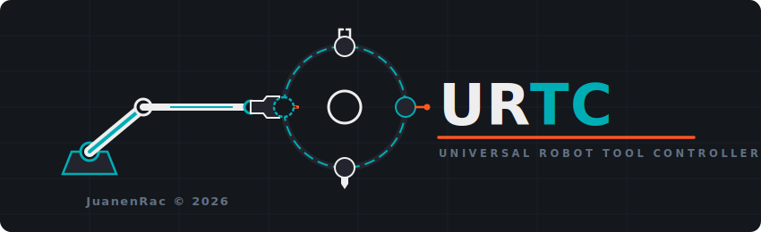
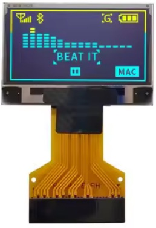
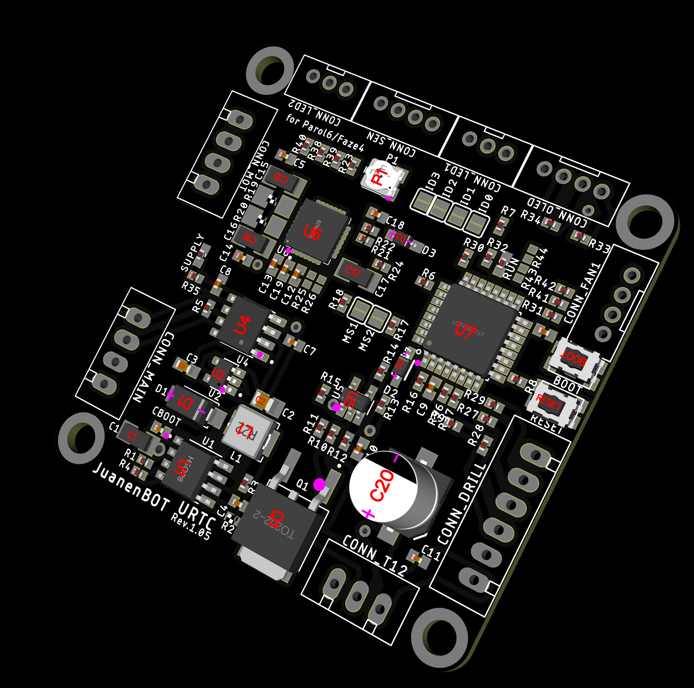
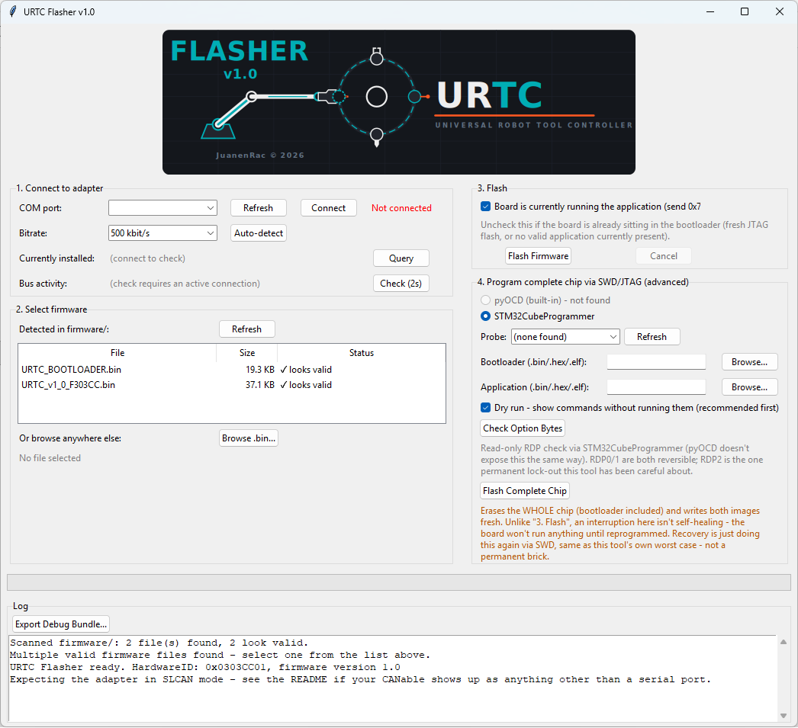
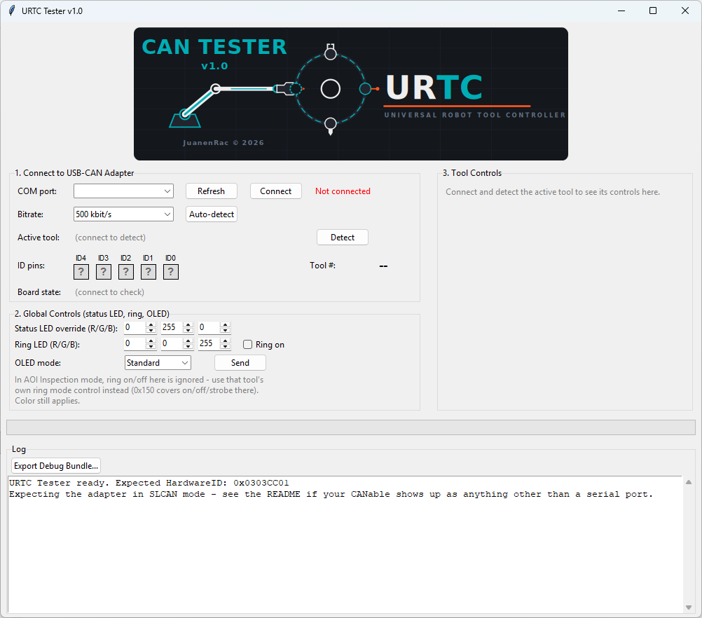

<p align="center">
  
</p>

# 🚀 URTC — Universal Robot Tool Controller (v1.0)

> **⚠️ Safety notice:** this board drives a **10W engraving laser diode** and multiple heater stages (T12 soldering iron cartridge, 3D printer hotend). Building and using it means working with equipment that can cause **burns, fire, or eye damage** if assembled or operated without proper safety measures (laser goggles rated for the diode's wavelength, thermal protection, an accessible power cutoff). This is a hobbyist/maker project shared as-is — build and use at your own risk, and don't skip basic safety practice just because the firmware has watchdogs.

Hi everyone! I wanted to share a project I've been developing called URTC (Universal Robot Tool Controller). It is a monolithic, highly integrated control board designed specifically to expand the capabilities of robotic arms and automation setups, making it a perfect match for platforms like PAROL6 and Faze4 — two open-source robotic arms designed and developed by [Source-Robotics](https://source-robotics.com/) ([GitHub](https://github.com/Source-Robotics)).

**URTC is an independent, unofficial project.** It isn't developed or endorsed by Source-Robotics — it's a compatible tool-head controller built to work well with PAROL6 and Faze4, and the same CAN-based architecture is open to adapting for other robotic arm platforms too.

Here is the complete breakdown of what it is, what it does, and the hardware ecosystem it currently manages.

**Status: 🚧 Work in progress.** Firmware and hardware are both under active iteration — expect rough edges, and treat anything here as a snapshot rather than a finished release.

---

## ⚙️ What is URTC?

URTC is an all-in-one, compact control board powered by an STM32 microcontroller (STM32F303CCT6, LQFP48). It communicates with the main robot controller via CAN bus, allowing for real-time, low-latency execution of complex tasks right at the tool head or axis. It features an onboard OLED display for instant diagnostics — animated boot splash, per-tool animated icons, live telemetry on a two-tone panel — a single-pixel RGB status LED plus an addressable RGB LED ring for camera illumination, a 20-pin expansion connector for add-on boards, an onboard F-RAM that persists the active tool's setpoints across a power loss, and dedicated analog and high-current power stages.

## 🛠️ Scalable Architecture & Tool Matrix

The core strength of URTC is its extreme versatility. Instead of swapping out electronics for every different job, the board features a scalable matrix architecture:

* **Up to 32 Tools Supported:** the hardware and communication protocol are designed to address up to 32 different tools or end-effectors directly at the robot head, via a 5-bit solder-jumper ID matrix (ID0-ID4).
* **12 Plug-and-Play Automated Profiles:** the firmware already automatically handles 12 pre-defined tools natively, with room for 20 more within the existing addressing scheme. The board reads the physical identity of the tool head and configures the power stages, sensors, and logic switching seamlessly without needing a full re-flash.

## 🔌 Hardware Flexibility & Motor Support

To handle such a wide variety of applications, the URTC hardware is fully equipped to control:

* **NEMA Stepper Motors:** NEMA 8, 11, 14, and 17 run directly off the onboard TMC2209, same as NEMA 23 and 34 — up to **2.0A** on any of them via the main board's driver stage. For NEMA 23/34 at their full rated torque, a TMC5160 on the expansion connector (see below) supports up to **10A**, current-scaled by the external MOSFETs/sense resistor chosen for that board — the onboard 2.0A limit doesn't apply once a motor's moved to the expansion driver.
* **3-Phase BLDC / Gimbal Motors** for high-precision movement.
* **Motors with Hall sensors and tachometers** for closed-loop control.
* **Dedicated inputs** for reflective optical proximity sensors like the TCRT5000, plus a generic active-low endstop/limit-switch input shared across four tool profiles.

## 🧩 Expansion Connector

A 20-pin header, separate from the tool-specific connectors, for add-on boards that need more than what a given tool profile alone exposes — an extra stepper axis (TMC2209 or TMC5160), a second sensor board, that kind of thing.

| Pins | Signal |
|---|---|
| 4 | 24V |
| 1 | 3.3V |
| 1 | 5V |
| 3 | GND |
| 2 | I2C2 (SCL/SDA) — its own bus, separate from I2C1/the OLED |
| 3 | STEP/DIR/EN — universal to either driver chip below |
| 4 | Bit-banged SPI (CS/SCK/MISO/MOSI) — for a TMC5160's configuration/diagnostics interface, or any other SPI-configurable chip |
| 1 | General-purpose GPIO (EXTI-capable interrupt input if a future add-on needs a fast sensor response, e.g. an endstop) |
| 1 | TMC5160 DIAG0 (stall/fault diagnostic line, polled via `0x182`/`0x183`) |

20 pins total.

**Two separate I2C buses on purpose:** I2C1 drives only the OLED; I2C2 is dedicated to this connector. Anything hanging off the expansion header — an I2C ADC/DAC, a port expander, whatever a given add-on board needs — shares I2C2 with any other expansion-side I2C device, but can't stretch the clock or otherwise interfere with the OLED's own timing on I2C1.

**A TMC2209 or a TMC5160, not necessarily both.** Both chips use the same STEP/DIR/EN interface for actual motion, so that part is universal. Where they differ is configuration/diagnostics: a TMC2209 uses its own single-wire UART for that, while a TMC5160 uses SPI — and since the two are mutually exclusive on any given expansion board, the 4 SPI pins double as a natural home for a TMC2209's single UART line too, rather than needing yet another dedicated pin nobody uses at the same time as the SPI bus. The bit-banged SPI bus talks the exact protocol a TMC5160 expects (SPI Mode 3, MSB first, CS held low for the whole transaction — see `CANBUS.TXT`'s `0x180`/`0x181` for the generic byte-passthrough command that drives it) rather than this firmware needing to know that chip's specific register layout. A TMC5160's DIAG0 stall/fault line is wired too (`0x182`/`0x183`) — it reuses one of the two general-purpose GPIO pins, which were already earmarked for exactly this kind of fast interrupt-driven input.

Full pin-by-pin detail — which MCU pin backs which signal, and the reasoning behind a couple of layout constraints this chip's 48-pin package has — lives in `PINOUT_CONNECTORS.TXT` and `firmware/README.md`.

## 💾 Parameter Persistence

An onboard FM24CL64B F-RAM (64Kbit, I2C) keeps a periodically-updated snapshot of the active tool's setpoints and the global LED/OLED settings, so a sudden power loss doesn't leave "what was this board doing" as unknowable as the loss itself was unplanned. It shares the OLED's I2C1 bus rather than getting one of its own — this MCU only has two I2C peripherals total, and both were already spoken for (see `firmware/README.md` section 6 for the full reasoning).

**Recovered state is queryable, never auto-applied to anything hazardous.** On boot, whatever was saved becomes readable over CAN (`0x190`/`0x191`) — but a heater setpoint, laser power, or motor command is never silently re-armed on its own. Only the safe, passive settings (LED colors, OLED mode) get restored directly. Deliberately re-sending a setpoint after actually reviewing what happened is left as the master controller's call, not something this board decides by itself the instant power comes back.

## 💼 Natively Automated Tool Catalog (The 12 Firmware Profiles)

Through its dynamic switching logic, the firmware natively manages the following tool heads:

1. **Soldering Station (T12):** precise PID temperature control using direct ADC feedback to handle standard T12 soldering tips. Generic endstop input available. [Jumper/wiring config →](images/TOOL_SOLDERING_IRON.png)
2. **SMT Solder Paste Dispenser:** millimetric feed control for precise solder paste deposition on PCBs. [Jumper/wiring config →](images/TOOL_PASTE_DISPENSER.png)
3. **Thermal Paste / Liquid Dispenser:** fluidity management for high-viscosity pastes or liquid adhesives. [Jumper/wiring config →](images/TOOL_LIQUID_DISPENSER.png)
4. **Smart Electric Screwdriver:** rotation and stop control based on torque limits or end-stops. [Jumper/wiring config →](images/TOOL_SCREWDRIVER.png)
5. **Vacuum / Pneumatic Gripper:** vacuum pump control and pressure level reading for safe Pick-and-Place operations. [Jumper/wiring config →](images/TOOL_VACUUM_PICKUP.png)
6. **Drill (BL4260):** PWM speed control, direction switching, and dynamic electric braking with real-time RPM readings, on its own dedicated enable/brake line, independent from the stepper-tool driver enable. Generic endstop input available. [Jumper/wiring config →](images/TOOL_DRILL.png)
7. **Gimbal Gripper:** high-sensitivity manipulation using 3-phase brushless gimbal motors. [Jumper/wiring config →](images/TOOL_GRIPPER_GIMBAL.png)
8. **NEMA Gripper:** robust clamping force controlled via a heavy-duty stepper motor. [Jumper/wiring config →](images/TOOL_GRIPPER_NEMA.png)
9. **AOI (Automated Optical Inspection) System:** synchronous stroboscopic control of the LED lighting array for machine vision camera capture. Generic endstop input available. [Jumper/wiring config →](images/TOOL_AOI_INSPECTION.png)
10. **Engraving Laser Diode (10W optical):** PWM beam power modulation with a safety hardware loop (CAN watchdog) that locks down if host communication is lost. Generic endstop input available. [Jumper/wiring config →](images/TOOL_LASER_ENGRAVER.png)
11. **3D Printing Hotend:** PID control of the heater cartridge, NTC thermistor reading, extruder control, and a dedicated 25kHz PWM-controlled layer cooling fan (4-wire, tachometer feedback, own communication watchdog) — all integrated into a single block. [Jumper/wiring config →](images/TOOL_3D_PRINTER.png)
12. **3D Scanner Probe:** ultra-fast hardware interrupt input (EXTI) with absolute priority for real-time surface digitization and impact sensing without lag. [Jumper/wiring config →](images/TOOL_SCAN_PROBE.png)

*(Tool config images will populate as the hardware documentation catches up — filenames above match the naming convention already in use for `images/`.)*

## 🖥️ Local OLED Interface

Every tool head shows live, tool-specific telemetry on a 128×64 two-tone OLED: an animated boot splash on power-up, a blinking CAN-activity indicator, a live "hero" reading in the top strip (temperature, RPM, power — whatever matters most for the active tool), and a small four-frame animated icon per tool profile.

### The module

Both physical variants below are the same panel electrically (SSD1306 or SSD1315-driven — the firmware's init sequence is verified compatible with both, see `OLED_Init()` in `STM32F303CC.C`; the SSD1315 is a newer, drop-in replacement controller that many modules ship with today under the same "SSD1306" listing/silkscreen), **128×64**, and the same two-tone "yellow/blue" split, where the physical LED material itself is divided into two fixed-color zones (this isn't software-selectable):

* **Top 16 pixels (pages 0-1): yellow.** URTC uses this strip for whatever's most useful to see at a glance without reading closely — the CAN-activity indicator, live hero readings, or (on the boot splash / invalid-tool screens) short status text.
* **Bottom 48 pixels (pages 2-7): blue.** Everything else — tool icons, detailed telemetry, the animated JuanenBOT face on the splash screen, the big blinking ERROR wordmark.

Both land on the same I2C1 bus and the same `OLED_Init()` — the firmware can't tell which of the two is attached, and doesn't need to. They're mutually exclusive on a given board (see `BOM.TXT`'s `CONN_OLED2` note - this document's name for what the schematic calls `LCD1`).

#### Option A — direct mount (`CONN_OLED2`, the footprint actually populated on the board)



A bare panel with no separate breakout PCB — just the glass and its 30-pin FPC ribbon, soldered straight into the `CONN_OLED2` footprint (`FPC30`, WiseChip UG-2864, this document's name for what the schematic calls `LCD1` — see `BOM.TXT` and `URTC_NETLIST.TXT`). Of the 30 pins, only a subset is actually wired — the rest is the panel's parallel-interface bus (`D2`–`D7`, `RW`, `E/!RD`), left unconnected since the board only ever talks to it over I2C:

| CONN_OLED2 pin(s) | Net | Function |
|---|---|---|
| 1, 8, 29, 30 | GND / AGND | Ground |
| 9 | VDD | Logic supply (from `+3V3B`, the OLED-only rail — see BOM §1) |
| 28 | VCC | Panel supply |
| 2–5 | C2P/C2N/C1P/C1N | Charge-pump caps — `C26`/`C27` in the BOM |
| 26 | IREF | Reference-current set resistor |
| 27 | VCOMH | Internal common-voltage decoupling |
| 10, 12 | BS0, BS2 | Tied to GND |
| 11 | BS1 | Tied to `+3V3B` |
| 18 | D0/SCK | I2C1 SCL — PA9 |
| 19 | D1/DIN/SDA | I2C1 SDA — PA10 |

`BS0`/`BS1`/`BS2` are the panel's own interface-select strap (GND/VCC/GND here), fixed in hardware rather than exposed to the MCU — this is what puts the controller in I2C mode in the first place, rather than the 8080/6800 parallel mode the other 22 FPC pins belong to.

#### Option B — breakout module (`CONN_OLED`, external alternative)


The same panel pre-mounted on a small carrier board with a 4-pin header — useful if you'd rather wire an off-the-shelf module than source the bare FPC panel. Wired straight to `CONN_OLED` with no crossing needed — the module's own pin order (`GND · VDD · SCK · SDA`) matches `CONN_OLED`'s pinout exactly, pin for pin:

| OLED module pin | CONN_OLED pin | Signal |
|---|---|---|
| GND | 1 | Ground |
| VDD | 2 | +3.3V (display logic power) |
| SCK | 3 | SCL — PA9, hardware I2C1 |
| SDA | 4 | SDA — PA10, hardware I2C1 |

### Boot splash


### Tool icons (one per profile, 4-frame animation)

<table>
<tr>
<td align="center"><br>T12 Soldering Iron</td>
<td align="center"><br>Paste Dispenser</td>
<td align="center"><br>Liquid Dispenser</td>
<td align="center"><br>Screwdriver</td>
</tr>
<tr>
<td align="center"><br>Vacuum Pickup</td>
<td align="center"><br>Drill (BL4260)</td>
<td align="center"><br>Gimbal Gripper</td>
<td align="center"><br>NEMA Gripper</td>
</tr>
<tr>
<td align="center"><br>AOI Inspection</td>
<td align="center"><br>Laser Engraver</td>
<td align="center"><br>3D Printer Hotend</td>
<td align="center"><br>3D Scanner Probe</td>
</tr>
</table>


### Invalid tool ID warning

If the ID jumpers don't match any of the 12 assigned profiles, the board blocks every actuator and blinks this instead:


All animation source GIFs live in [`/ani`](ani/).

## 🔴🟢🔵 Digital Status LED

Separate from the OLED and the 8-pixel illumination ring, `CONN_LED1` carries a single addressable RGB LED (WS2812B-family, SPI/DMA-driven) dedicated to at-a-glance status.

**Automatic by default, host-overridable on demand.** The firmware colors this LED on its own, three-way priority:

* 🔴 **Red** — a hardware fault is active (`system_error_flag`). Always wins, regardless of anything else going on.
* 🔵 **Blue** — the board is actively functioning: a CAN frame (any ID) arrived within the last 1.5 seconds.
* 🟢 **Green** — idle, waiting for commands: no CAN traffic in over 1.5 seconds.

The master can still override this at any point by sending CAN ID `0x100` (DLC 8) with the red, green, and blue intensity as the first three bytes (0-255 each — full 24-bit color, not just the three automatic ones). A host-sent color holds for 10 seconds before falling back to the automatic scheme — long enough to actually be seen, short enough that the board doesn't get stuck showing a stale custom color if the host stops updating it. Sending `0x100` again (whether the same color or a new one) refreshes that 10-second window, so a host that wants to keep custom control just needs to keep sending it periodically. A hardware fault always interrupts an active override — red takes priority over any color the host had set.

See `CANBUS.TXT` (ID `0x100`) for the exact byte layout, which also shares this same message with the ring LED and OLED night-mode control.

## 📸 Photos



*(Work in progress — more angles and a populated board coming soon.)*

## 📂 Repository Structure

```
/
├── 3D/
│   ├── STL/                     Directory of 3D Tools parts for print in STL format
│   └── OpenSCAD/                Directory of 3D Tools parts
├── ani/
│   └── *.gif                    Gif files of logos for OLED.
├── BOM/
│   ├── BOM.TXT                  Full bill of materials of PCB board
│   ├── BOM_PARTS.TXT            Full bill of materials and mechanical parts for 3D parts
│   └── BOM_PARTS.PDF            Full bill of materials and mechanical parts for 3D parts
├── docs/
│   ├── MANUAL.PDF               Service manual of URTC board and 3D Files
│   ├── MANUAL.ODT               Service manual of URTC board and 3D Files
│   ├── CANBUS.TXT               CAN bus protocol reference (all command/telemetry IDs)
│   ├── ECOVIA.TXT               Tool identification matrix and pin-mutation logic
│   ├── PINOUT.TXT               Full MCU pinout, block by block
│   ├── PINOUT_CONNECTORS.TXT    Physical connector pinouts (CONN_DRILL, CONN_SEN, etc.)
│   ├── JTAG_SWD_FEASIBILITY.md  SWD/JTAG programming feasibility study behind tools/'s section 4
│   ├── BUILD_REPORT.md          How BOOTLOADER.C/STM32F303CC.C were actually compiled and linked -
│   │                            toolchain, HAL/CMSIS source, linker scripts, real output sizes
│   └── AUDIT_v1.0_SIMULATION.md Full v1.0 code/consistency audit and simulation report
├── firmware/
│   ├── BOOTLOADER.C              CAN bootloader source (listens for updates, verifies, jumps to app)
│   ├── URTC_BOOTLOADER.bin       Bootloader compiled, flash to 0x08000000
│   ├── URTC_BOOTLOADER.elf       Bootloader compiled, flash to 0x08000000
│   ├── URTC_BOOTLOADER.hex       Bootloader compiled, flash to 0x08000000 (address baked in)
│   ├── STM32F303CC.C             Main application firmware, single-file monolithic build
│   ├── URTC_v1_0_F303CC.bin      Application bin compiled, flash to 0x08008000
│   ├── URTC_v1_0_F303CC.elf      Application elf compiled, flash to 0x08008000
│   ├── URTC_v1_0_F303CC.hex      Application HEX compiled, flash to 0x08008000 (address baked in)
│   ├── STM32F303CCTx_BOOTLOADER.ld  Linker script for the bootloader (30K region at 0x08000000)
│   ├── STM32F303CCTx_APP.ld      Linker script for the application (112K main slot at 0x08008000)
│   └── README.md                 Technical reference: hardware platform, the ID-jumper
│                                 tool-selection system, per-tool peripheral wiring, and
│                                 the bootloader's update mechanism - see CANBUS.TXT for
│                                 the wire-level protocol this document explains the why of
├── images/
│   ├── OLED_DIRECT_MOUNT.jpg     LCD1/CONN_OLED2 - bare 30-pin FPC panel, direct-mount option
│   ├── OLED_BREAKOUT_MODULE.jpg  CONN_OLED - external I2C breakout module, alternate option
│   ├── URTC_LOGO.svg             General project logo, embedded at the top of this README -
│   │                            same artwork as the tool banners below, minus the tool-specific label
│   ├── URTC_LOGO_FLASHER.svg     Flasher tool's banner logo (also embedded at
│   │                            tools/flasher/assets/ for the tool itself - kept in both
│   │                            places so the GitHub-rendered tools/flasher/README.md
│   │                            doesn't depend on a path outside tools/flasher/)
│   ├── URTC_LOGO_TESTER.svg      Same reasoning, for the Tester tool's banner
│   ├── URTC_FLASHER_V1_0.png     Flasher tool window screenshot, referenced in this README
│   ├── URTC_TESTER_V1_0.png      Tester tool window screenshot, referenced in this README
│   ├── URTC_BOARD.png           Board photo (when added)
│   ├── URTC_SCHEMATIC.png       Board schematic (when added)
│   ├── URTC_PCB_TOP.png         Board TOP layer (when added)
│   ├── URTC_PCB_BOTTOM.png      Board BOTTOM layer (when added)
│   └── TOOL_*.png               Per-tool jumper/wiring reference photos, one per profile
│                                (when added - see each tool's own link in the Tool Profiles section)
├── PCB/
│   ├── URTC_V1.0.sch            Eagle schematic (when added)
│   ├── URTC_V1.0.brd            Eagle board layout (when added)
│   ├── URTC_V1.0_JLCPCB.ZIP     Gerbers, bom and cpl files 
│   ├── datasheet/               Datasheets of all parts used in board
│   └── *_PARLIST/PINLIST/NETLIST.TXT   Eagle-exported netlists (ground truth for pin mapping)
├── tools/
│   ├── flasher/                 CAN OTA update + full-chip SWD/JTAG programming
│   │   ├── assets/
│   │   │   ├── URTC_LOGO_FLASHER.svg  Banner logo source (vector)
│   │   │   ├── urtc_banner.png        Shown centered on screen for 5s at startup (a splash,
│   │   │   │                          not part of the main window), rendered from the .svg above
│   │   │   ├── URTC_APP_ICON.svg      App icon source (vector) - a simplified standalone design,
│   │   │   │                          not the banner shrunk down (which doesn't hold up at 16-32px)
│   │   │   ├── urtc_icon.png          Window/taskbar icon (Windows + Linux, via root.iconphoto)
│   │   │   └── urtc_icon.ico          Same icon, multi-resolution, for the compiled .exe itself
│   │   ├── firmware/            Compiled .bin(s) to flash - kept inside tools/flasher/
│   │   │                        (not at the repo root) so this whole folder can be
│   │   │                        copied and shared on its own, fully self-contained
│   │   ├── logs/                 Auto-created at runtime, one session log file each run - safe to delete
│   │   ├── urtc_config.json     Optional, not included by default - overrides HMAC_KEY/HardwareID/
│   │   │                        memory-map constants without touching urtc_flasher.py itself
│   │   ├── urtc_flasher.py      Cross-platform GUI/CLI tool
│   │   ├── requirements.txt     Python dependencies (just pyserial)
│   │   ├── build_exe.bat        Packages the tool as a standalone .exe (Windows, no Python needed to run it)
│   │   ├── build_exe.sh         Same, for Linux (produces a native binary, not a cross-compiled .exe)
│   │   └── README.md            Tool-specific setup and usage instructions
│   └── tester/                  Live CAN bus exerciser - reads whichever tool profile a
│       │                        board is jumpered for and shows only that tool's own
│       │                        controls/telemetry, per CANBUS.TXT
│       ├── assets/
│       │   ├── URTC_LOGO_TESTER.svg   Banner logo source (vector)
│       │   ├── urtc_tester_banner.png Same 5s startup splash as the flasher, rendered from the .svg above
│       │   ├── URTC_APP_ICON.svg      Same icon source as the flasher (shared design)
│       │   ├── urtc_icon.png          Window/taskbar icon
│       │   └── urtc_icon.ico          Same icon, multi-resolution, for the compiled .exe itself
│       ├── logs/                 Auto-created at runtime, same as the flasher's
│       ├── urtc_tester.py       Cross-platform GUI tool
│       ├── requirements.txt     Python dependencies (just pyserial)
│       ├── build_exe.bat        Standalone .exe build (Windows)
│       ├── build_exe.sh         Standalone binary build (Linux)
│       └── README.md            Tool-specific setup and usage instructions
├── LICENSE
└── README.md                    This file
```

Hardware design files (Eagle schematic/board/netlists) will be added as the layout stabilizes.

## 🔧 Building & Flashing

URTC's flash is split into two independent pieces, so the board can be reflashed over the same CAN umbilical it already uses for everything else — without ever needing physical access to the JTAG/SWD header again after the first setup.

### Flash memory layout (256K total, golden-image / A-B update model)

```
0x08000000 ┌─────────────────────────────────┐
           │  Bootloader (30K)                 │  Always runs first on every boot.
           │                                   │  Listens briefly on CAN, then either
           │                                   │  jumps to the app or waits for an
           │                                   │  update. Drives the OLED directly
           │                                   │  during an update (see below).
0x08007800 ├─────────────────────────────────┤
           │  Metadata page (2K)               │  Describes whatever's in the main
           │                                   │  slot right now: HardwareID,
           │                                   │  version, size, CRC32, and an
           │                                   │  HMAC-SHA256 signature. The
           │                                   │  bootloader checks all of it
           │                                   │  before ever jumping to the app.
0x08008000 ├─────────────────────────────────┤
           │  Main slot (112K)                 │  This is STM32F303CC.C /
           │                                   │  URTC_v1_0_F303CC.* — the actual
           │                                   │  firmware that runs day to day,
           │                                   │  described everywhere else in
           │                                   │  this README. Never touched by
           │                                   │  an update until a verified,
           │                                   │  known-good image is ready to
           │                                   │  replace it.
0x08024000 ├─────────────────────────────────┤
           │  Backup / staging slot (112K)     │  Raw storage only, never
           │                                   │  directly executed. Every CAN
           │                                   │  update writes here first.
0x08040000 └─────────────────────────────────┘
```

**Why a backup slot.** A CAN update is never written into the slot that's currently running. It goes into backup first, gets fully verified there — size, CRC32, and an HMAC-SHA256 signature proving it actually came from this project's own build process, not just that it arrived intact — and only then gets copied into the main slot. A power loss at any point before that copy starts leaves the currently running firmware completely untouched, so there's no window where an interrupted download can brick the board. If the power loss happens *during* the copy itself, the bootloader notices on the next boot (backup, never touched during the copy, is still fully intact) and simply resumes copying from it until it succeeds.

### 1. First-time setup — requires JTAG/SWD (once)

The bootloader can only get onto the chip via physical programming — there's no way to CAN-flash a board that doesn't have a bootloader on it yet. This is a one-time step:

1. Open the project in **STM32CubeIDE** (built and tested against the STM32F303CC target), or use **STM32CubeProgrammer** directly with the compiled outputs below.
2. Flash **both** images over SWD (ST-Link) via the onboard `STM_JTAG` header — each `.hex` file has its target address baked in, so most tools (including STM32CubeProgrammer) can load both in the same session:
   * `URTC_BOOTLOADER.hex` → `0x08000000`
   * `URTC_v1_0_F303CC.hex` → `0x08008000`
3. Set the tool identity via the ID solder jumpers before powering up — the board reads them once at boot, same as always. Five jumpers (ID0-ID4), covering the full 32-address space.
4. Power up. The bootloader listens for ~600ms, sees nothing, and jumps straight into the application — from here on, everything behaves exactly as described in the rest of this README.

**The JTAG header is never removed or disabled.** It's always there as a fallback — if a CAN update ever goes wrong, or you just prefer it, you can reflash either image over SWD at any time.

**Two onboard pushbuttons, BOOT and RESET**, are also there for recovery — RESET is an ordinary hardware reset (`NRST`), and BOOT pulls `BOOT0` high, which is a chip-level decision made *before* anything in this repository runs at all: normally (not held) the chip boots from flash into this project's own bootloader as described above; held at reset, it boots into ST's own factory System Memory bootloader instead (USB DFU/UART recovery, entirely separate from anything here). See `firmware/README.md` section 4a for the full technical detail.

### 2. Subsequent updates — over CAN bus

Once the bootloader is in place, updating the application no longer needs physical access to the board at all — just send the new `STM32F303CC.C` build over the same umbilical CAN line already carrying commands to the tool head.

**The update sequence:**

1. **Trigger.** The master sends `0x7F0` (DLC 4, payload `B0 07 1D 5A`) to the *running application*. It safely cuts power to every actuator inline — motors, heaters, laser — and resets the chip. This magic-payload requirement means a corrupted or malformed frame can't accidentally trigger a reset into update mode.
2. **Start.** After reset, the bootloader is listening. The master sends `0x7F1` (DLC 8, big-endian total firmware size + big-endian HardwareID). An image built for different hardware is rejected right here, before a single byte of flash gets touched. The bootloader erases exactly as many backup-slot pages as the new image needs and replies with a status frame (`0x7F5`).
3. **Signature.** The master sends the expected HMAC-SHA256 signature as four `0x7F7` frames (8 bytes each, in order) — computed over the firmware image with a key shared between the bootloader and whatever tool signs the build.
4. **Data.** The master streams the `.bin` file as a sequence of `0x7F2` frames (up to 8 bytes of raw firmware data each), sent back-to-back — CAN guarantees frames arrive in the order they were sent on a single bus, so no per-frame sequence number is needed. The bootloader buffers incoming bytes into a 2KB page in RAM and writes it to the *backup* slot once full, reading every half-word back and comparing it against what was meant to be written before considering the page done, and sending a `0x7F3` acknowledgement (with the page index) after each verified write. A reasonable master implementation waits for each page's ACK before sending the next page's worth of data, to avoid overrunning the bootloader's receive buffer.
5. **End & verify.** Once every byte has been sent, the master sends `0x7F4` (DLC 8, big-endian CRC32 + version major/minor). The bootloader checks the backup slot's size, computes its CRC32 and HMAC-SHA256 and compares both against what the master declared. Only if everything matches does it proceed to copy backup into the main slot, page by page, with the same read-back verification as above. Once that copy is complete and confirmed, it saves the new metadata and resets into the updated application. On any mismatch — size, CRC32, HMAC, or HardwareID — the main slot is never touched at all, and the bootloader just goes back to listening for a fresh attempt.

**Status frames (`0x7F5`, DLC 1):** `0x01` listening, `0x02` erasing, `0x03` receiving, `0x06` verifying, `0x07` copying backup into main, `0x04` verified OK (about to jump), `0x05` verification failed, `0xFF` error.

**Heartbeat (`0x7F6`, DLC 2, every ~1s while listening or updating):** status byte + progress percent (0-100, or `0xFF` where a percentage doesn't apply). Lets the master tell "node is alive but hasn't started listening yet" apart from "node is completely unresponsive" - useful for automated bring-up and for spotting a stuck bootloader without waiting for a timeout.

**On-screen progress.** The bootloader drives the OLED directly during an update — nobody has to guess whether anything is happening. It shows "UPDATING" plus a live progress bar and percentage while pages are being written or copied, "FLASH OK" for a beat before it resets into the new firmware, and "ERROR" if a page write fails, the transfer stalls for more than 10 seconds, or verification comes back with a mismatch.

**⚠️ Bench-test this before trusting it in the field.** The protocol above compiles and links clean and the logic has been reasoned through carefully, but a bootloader is exactly the kind of firmware where "builds correctly" is a long way from "trustworthy on hardware" — the real flash-programming timing, CAN behavior across a multi-thousand-frame transfer, and the bootloader-to-application handoff all need to be verified on an actual board (ideally with JTAG on hand as a fallback) before relying on this for an unattended update with real actuators connected.

### PC Tools — `tools/`

Two standalone, cross-platform (Windows/Linux) GUI tools live here, each
in its own self-contained subfolder so either can be copied and shared on
its own.

#### URTC Flasher v1.0 — `tools/flasher/`

<p align="center">
  
</p>

Two distinct jobs:

- **CAN OTA update** — drives the update sequence above over a USB-CAN adapter, either through an SLCAN-compatible serial port (Windows/Linux) or directly over Linux's native SocketCAN (no adapter reflash needed on most CANable-family boards that way). Implements the full protocol: HardwareID check, HMAC-SHA256 signing, page-by-page transfer with ACKs, live progress via the bootloader's heartbeat, and a version query so you can see what's currently installed (application or bootloader, either one answers) before deciding what to flash.
- **Full-chip SWD/JTAG programming** — a separate, clearly-marked section for mass-erasing the whole chip and writing both the bootloader and application images fresh, via either pyOCD (no separate install beyond the pip package) or STM32CubeProgrammer. This is the same kind of operation as a first JTAG bring-up, not an OTA update — it isn't self-healing the way the CAN path is, though recovering from an interrupted attempt just means reconnecting and flashing again, the same as any first-time bring-up.

```
cd tools/flasher
pip install -r requirements.txt
python urtc_flasher.py          # Windows
python3 urtc_flasher.py         # Linux
```

Or build a standalone binary that doesn't need Python installed: `build_exe.bat` on Windows, `./build_exe.sh` on Linux.

**Firmware files go in `tools/flasher/firmware/`** (inside the tool's own folder, not at the repo root — this keeps `tools/flasher/` self-contained and shareable on its own). Multiple versions can sit there at once — every file gets checked against the same plausibility test the bootloader itself applies (valid stack pointer, sane size) and listed with a clear ✓/✗, auto-selecting only when there's exactly one that passes. Browse still works for a file anywhere else. See `tools/flasher/README.md` for the full detail on both the CAN and SWD/JTAG paths, including Linux-specific setup (serial permissions, SocketCAN interface bring-up) and how the version-query display works.

**One-time adapter setup (Serial/SLCAN path):** a CANable Pro v2 ships by default running candleLight firmware, which talks to the host over the `gs_usb` protocol — not a serial port, and not what the Serial/SLCAN transport speaks. Getting it recognized as a serial port means flashing SLCAN-compatible firmware onto the adapter first, a one-time step separate from anything to do with URTC itself. **This step is skippable on Linux** if you use the SocketCAN transport instead — that one talks to the adapter's default `gs_usb` firmware natively through the kernel driver, no reflash needed. See `tools/flasher/README.md` for the full walkthrough of both paths.

**Verified independently of hardware:** the tool's CRC32 and HMAC-SHA256 computation were checked byte-for-byte against the bootloader's own C implementation on the same test data — identical output on both sides. The SLCAN frame formatting/parsing and the SocketCAN frame packing (checked against Linux's `struct can_frame` layout with a round-trip test) each have their own tests. The SWD/JTAG section's command construction was verified via its dry-run mode for both `.bin` and `.hex` inputs. What hasn't been exercised on either flashing path is the full sequence against a real adapter/probe and a real board — treat a first attempt with the same caution as the bootloader itself above.

#### URTC Tester v1.0 — `tools/tester/`

<p align="center">
  
</p>

A live CAN bus exerciser, not a flashing tool — it never touches flash,
only runtime commands and telemetry against whatever firmware is already
running. Connects the same way the flasher does, then asks the board
(over the `0x110`/`0x111` query pair — see `CANBUS.TXT`) which of the
12 tool profiles it's currently jumpered for, and builds a single panel
showing only that tool's own controls and live telemetry — a soldering
iron's setpoint-and-readback, a drill's speed/direction/RPM, the AOI
ring's strobe mode, the 3D printer's full thermal+motion+fan set, and so
on — rather than one window trying to represent all 12 at once. A
separate Global Controls panel (status LED, ring LED color, OLED mode)
stays visible regardless of which tool is active, since `0x100` applies
to all of them.

Handles the firmware's own communication watchdogs automatically: the
soldering iron, laser, and 3D-printer nozzle each auto-resend their
setpoint every 150ms for as long as they're switched on (the firmware
cuts them after 250ms of silence), and the layer fan does the same every
400ms (1000ms watchdog) - matching what a real master controller has to
do, rather than sending a command once and having the tool head shut it
off a fraction of a second later.

```
cd tools/tester
pip install -r requirements.txt
python urtc_tester.py          # Windows
python3 urtc_tester.py         # Linux
```

Or build a standalone binary the same way as the flasher: `build_exe.bat`
/ `./build_exe.sh`. See `tools/tester/README.md` for the full per-tool
control/telemetry table.

## 📋 Changelog

Firmware (`STM32F303CC.C`) and bootloader (`BOOTLOADER.C`) are versioned
and released independently - flashing a new bootloader doesn't imply a
new application version and vice versa, so each gets its own history
here rather than one combined version number that would imply they
always move together.

### Firmware (`STM32F303CC.C`)

| Version | Notes |
|---|---|
| **1.0** | Initial versioned release. Full support for all 12 tool profiles, hardware I2C1 OLED, per-tool CAN telemetry, and the communication/stall watchdogs described throughout this README. Also includes the `0x110`/`0x111` active-tool query added for the Tester tool. |

### Bootloader (`BOOTLOADER.C`)

| Version | Notes |
|---|---|
| **1.0.0** | Initial versioned release. HMAC-SHA256 signed OTA updates, golden-image A/B backup slot, and `0x7FA` - the bootloader's own version, reported alongside `0x7F9` (the installed application's version) whenever the bootloader itself answers a version query. |
| **1.0.1** | Anti-rollback protection (a validly-signed image older than what's installed is rejected - `0x05` verify-fail reason `0x05`), stricter jump-to-application checks (stack alignment, Thumb-state and address-range validation on the reset vector), a corrected RAM bound matching this chip's actual 40KB of contiguous SRAM, and general hardening around the OLED/CAN/flash timing paths. |

## 🔍 Current Status

The core firmware is built as a highly optimized, single-file monolithic architecture to ensure deterministic timing (hardware ISRs drive everything from OLED rendering to the diagnostic LED heartbeat).

**Firmware (`STM32F303CC.C`):** feature-complete for all 12 tool profiles — thermal PID control, per-tool telemetry, communication watchdogs, stall/fault detection, and the OLED's own live diagnostics, alongside an active-tool query pair (`0x110`/`0x111`), a generic SPI passthrough (`0x180`/`0x181`) for the expansion connector, and an onboard F-RAM that persists setpoints across a power loss (`0x190`/`0x191`). Versioned independently of the bootloader (see the Changelog below).

**Bootloader (`BOOTLOADER.C`):** feature-complete golden-image A/B update system — HMAC-SHA256 signed OTA updates over CAN, a backup slot that guarantees a failed update never bricks the board, and its own version reporting (`0x7FA`) independent of the application. Compiles and links clean; see the bench-test caveat above before trusting it unattended with real actuators connected.

**PC tools (`tools/`):** both `URTC Flasher` (CAN OTA updates + full-chip SWD/JTAG programming) and `URTC Tester` (live per-tool control/telemetry exerciser) are feature-complete for what they set out to do, each with their own README covering setup and every control in detail.

**Hardware:** schematic and BOM are still being finalized; no populated board exists yet to validate any of the above against real silicon. Everything above compiles, links, and has been reasoned through carefully, but "builds correctly" and "verified on hardware" are two different claims — see the safety notice at the top of this README, and treat a first bring-up with the caution any new board deserves.

If anyone in the community is working on custom end-effectors, smart tool-changers, or advanced tool integration for PAROL6, Faze4, or any other robot arm platform, I'd love to chat, swap ideas, or dive deeper into the CAN commands!

## 👤 Author

**JuanenRac** (Electro Hobby 3D)
📧 electrohobby3d@gmail.com
📺 [youtube.com/@electrohobby3d](https://youtube.com/@electrohobby3d)

## 📜 License and Copyright Notices

URTC is (c) 2026 JuanenRac (Electro Hobby 3D). This notice must be included in any distributions of this project or derivative works.

Because this project consists of several different types of content, individual parts are made available under different licenses - each suited to what it actually covers, rather than forcing one license to fit everything:

1. The **firmware** located at `./firmware` (application and CAN bootloader alike) is available under the **GNU General Public License v3.0 (GPL-3.0)**. Full text at https://www.gnu.org/licenses/gpl-3.0.html.

2. The **PC tools** at `./tools` are source code, licensed the same way and for the same reason as the firmware: **GNU General Public License v3.0 (GPL-3.0)**. This covers `urtc_flasher.py` and `urtc_tester.py` themselves and any `.exe`/binary built from either via their respective `build_exe.bat`/`build_exe.sh` — distributing a compiled tool means distributing something GPL-3.0 covers, same as distributing a compiled firmware `.bin` does.

3. The **hardware designs** (Eagle schematic/board files, gerbers, and the 3D-printable parts under `./PCB` and `./3D`) are available under the **CERN Open Hardware Licence v2 - Strongly Reciprocal (CERN-OHL-S v2)**. Full text at https://cern-ohl.web.cern.ch/.

4. The **documentation** (this README, the service manual, and the reference files under `./docs`, including `./tools/flasher/README.md` and `./tools/tester/README.md`) is available under **Creative Commons Attribution-ShareAlike 4.0 International (CC BY-SA 4.0)**. Full text at https://creativecommons.org/licenses/by-sa/4.0/.

If you build on this project, keep the licensing split in mind: code changes to the firmware or the flashing tool should stay GPL-3.0, hardware modifications should stay CERN-OHL-S, and documentation derivatives should stay CC BY-SA - each with attribution back to this project.
