<p align="center">
  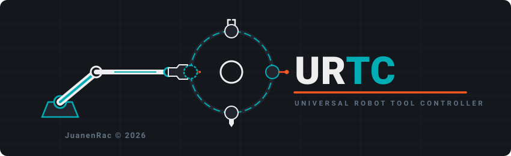
</p>

# 🚀 URTC — Universal Robot Tool Controller (v0.2)

<p align="center">
  <a href="README.md">🇺🇸 English</a> |
  <a href="README_spa.md">🇪🇸 Español</a> |
  🇫🇷 <b>Français</b> |
  <a href="README_ita.md">🇮🇹 Italiano</a> |
  <a href="README_deu.md">🇩🇪 Deutsch</a> |
  <a href="README_zho.md">🇨🇳 简体中文</a> |
  <a href="README_jpn.md">🇯🇵 日本語</a>
</p>


<p align="left">
  
  
  
  
  
</p>


> **⚠️ Avis de sécurité :** cette carte pilote une **diode laser de gravure de 10W** et plusieurs étages de chauffe (cartouche de fer à souder T12, hotend d'imprimante 3D). La construire et l'utiliser signifie travailler avec un équipement pouvant causer des **brûlures, un incendie, ou des dommages oculaires** si elle est assemblée ou utilisée sans mesures de sécurité adéquates (lunettes laser adaptées à la longueur d'onde de la diode, protection thermique, une coupure d'alimentation accessible). Il s'agit d'un projet amateur/maker partagé tel quel — construisez-le et utilisez-le à vos propres risques, et ne négligez pas les pratiques de sécurité de base simplement parce que le firmware dispose de watchdogs.

Bonjour à tous ! Je voulais partager un projet que je développe, appelé URTC (Universal Robot Tool Controller). C'est une carte de contrôle monolithique, hautement intégrée, conçue spécifiquement pour étendre les capacités des bras robotiques et des installations d'automatisation, ce qui en fait un excellent complément pour des plateformes comme PAROL6 et Faze4 — deux bras robotiques open-source conçus et développés par [Source-Robotics](https://source-robotics.com/) ([GitHub](https://github.com/Source-Robotics)).

**URTC est un projet indépendant et non officiel.** Il n'est ni développé ni approuvé par Source-Robotics — c'est un contrôleur d'outil compatible, construit pour bien fonctionner avec PAROL6 et Faze4, et la même architecture basée sur CAN peut être adaptée à d'autres plateformes de bras robotiques.

Voici le détail complet de ce que c'est, ce que ça fait, et l'écosystème matériel qu'elle gère actuellement.

**Statut : 🚧 Projet en évolution active — pas encore de Release.** URTC est en développement continu et actif sur les deux fronts à la fois : le firmware (nouveaux profils d'outils, l'écosystème d'esclaves d'extension, changements de protocole) et le matériel (schéma et nomenclature encore en cours de finalisation, aucune carte peuplée n'existe encore). Comme les deux côtés avancent ensemble, ce que contient ce dépôt à un instant donné est une photographie d'un travail en cours, et non un produit stable et versionné — les noms de fichiers, la structure des dossiers, le nombre d'outils, et la documentation peuvent tous encore changer à mesure que la conception se stabilise. Une fois que le firmware et le matériel auront tous deux atteint un état véritablement stable et vérifié sur du matériel réel, une véritable **Release** sera taguée, regroupant le tout (firmware, bootloader, outils PC, fichiers de conception matérielle, et documentation) en une photographie cohérente et figée. D'ici là, considérez `main` comme la cible activement mouvante qu'elle est.

---

## ⚙️ Qu'est-ce qu'URTC ?

URTC est une carte de contrôle compacte tout-en-un, alimentée par un microcontrôleur STM32 (STM32F303CCT6, LQFP48). Elle communique avec le contrôleur principal du robot via un bus CAN, permettant l'exécution en temps réel et à faible latence de tâches complexes directement au niveau de la tête d'outil ou de l'axe. Elle intègre un écran OLED embarqué pour un diagnostic instantané — écran d'accueil animé, icônes animées par outil, télémétrie en direct sur un panneau bicolore — une LED RVB unique de statut ainsi qu'un anneau de LED RVB adressables pour l'éclairage de caméra, un connecteur d'extension 20 broches pour des cartes complémentaires, une F-RAM embarquée qui conserve les consignes de l'outil actif en cas de coupure de courant, et des étages d'alimentation analogiques et haute intensité dédiés.

## 🛠️ Architecture évolutive et matrice d'outils

La force principale d'URTC est son extrême polyvalence. Au lieu de changer d'électronique pour chaque tâche différente, la carte propose une architecture matricielle évolutive :

* **Schéma d'identification à 32 adresses :** le matériel et le protocole de communication sont conçus pour identifier jusqu'à 32 outils ou effecteurs différents directement au niveau de la tête du robot, via une matrice d'identification à 5 bits par cavaliers à souder (ID0-ID4). Sur ces 32 lectures possibles, 31 correspondent directement à un profil d'outil ; la 32e (les 5 cavaliers installés, `11111`) est réservée comme adresse de « configuration libre » — voir ci-dessous.
* **25 profils automatisés prêts à l'emploi :** le firmware gère nativement 25 profils d'outils - la carte lit l'identité physique de la tête d'outil et configure les étages de puissance, les capteurs, et la commutation logique de façon transparente, sans nécessiter de reflashage complet. 6 adresses supplémentaires restent libres dans le schéma existant pour de futurs profils d'outils.
* **Configuration d'outil libre :** la lecture de cavaliers réservée `11111` ne sélectionne pas un outil fixe - elle indique à la carte de consulter, dans un registre de sa propre F-RAM persistante, quel outil utiliser, réglé au préalable via CAN (via `URTC Flasher`). Utile pour une carte qui doit être reprogrammée vers un outil différent sans ressouder physiquement les cavaliers. Voir `docs/EEPROM.TXT` section 5 pour le mécanisme complet.

## 🔌 Flexibilité matérielle et support moteurs

Pour gérer une aussi grande variété d'applications, le matériel d'URTC est entièrement équipé pour contrôler :

* **Moteurs pas à pas NEMA :** les NEMA 8, 11, 14, et 17 fonctionnent directement via le TMC2209 embarqué, tout comme les NEMA 23 et 34 — jusqu'à **2.0A** sur n'importe lequel d'entre eux via l'étage de pilotage de la carte principale. Pour les NEMA 23/34 à leur couple nominal complet, un TMC5160 sur le connecteur d'extension (voir ci-dessous) supporte jusqu'à **10A**, mise à l'échelle du courant selon les MOSFETs externes/résistance de mesure choisis pour cette carte — la limite embarquée de 2.0A ne s'applique plus une fois le moteur déplacé vers le pilote d'extension.
* **Moteurs BLDC 3 phases / moteurs gimbal** pour un mouvement de haute précision.
* **Moteurs avec capteurs à effet Hall et tachymètres** pour un contrôle en boucle fermée.
* **Entrées dédiées** pour capteurs de proximité optiques réflectifs comme le TCRT5000, plus une entrée générique de fin de course active-bas partagée entre quatre profils d'outils.

## 🧩 Connecteur d'extension

Un connecteur 20 broches, séparé des connecteurs spécifiques aux outils, pour des cartes complémentaires ayant besoin de plus que ce qu'un profil d'outil donné expose à lui seul — un axe pas à pas supplémentaire (TMC2209 ou TMC5160), une seconde carte de capteurs, ce genre de chose.

| Broches | Signal |
|---|---|
| 4 | 24V |
| 1 | 3.3V |
| 1 | 5V |
| 3 | GND |
| 2 | I2C bit-bang (SCL/SDA) — son propre bus, séparé de l'I2C2 matériel de l'OLED/F-RAM |
| 3 | STEP/DIR/EN — universel pour l'une ou l'autre des puces pilotes ci-dessous |
| 4 | SPI bit-bang (CS/SCK/MISO/MOSI) — pour l'interface de configuration/diagnostic d'un TMC5160, ou toute autre puce configurable en SPI |
| 1 | GPIO usage général (entrée d'interruption compatible EXTI si une future extension a besoin d'une réponse capteur rapide, ex. une fin de course) |
| 1 | TMC5160 DIAG0 (ligne de diagnostic de blocage/défaut, interrogée via `0x182`/`0x183`) |

20 broches au total.

**Deux bus I2C séparés, intentionnellement :** l'OLED/F-RAM utilisent le seul périphérique I2C matériel utilisable de cette puce (I2C2, sur PA9/PA10) ; le connecteur d'extension dispose de son propre bus I2C bit-bang indépendant (PB10/PB11 - les seules autres paires de broches compatibles I2C de cette puce étaient déjà réservées à d'autres fonctions, donc le bit-bang était le moyen de donner à ce connecteur son propre bus sans conflit matériel). Tout ce qui se branche sur le connecteur d'extension — un ADC/DAC I2C, un extenseur de port, quoi que ce soit dont une carte d'extension donnée ait besoin — partage ce bus bit-bang avec tout autre périphérique I2C côté extension, mais ne peut pas étirer l'horloge ni interférer autrement avec le timing propre de l'OLED sur son bus I2C2 matériel séparé.

**Un TMC2209 ou un TMC5160, pas nécessairement les deux.** Les deux puces utilisent la même interface STEP/DIR/EN pour le mouvement réel, donc cette partie est universelle. Elles diffèrent sur la configuration/diagnostic : un TMC2209 utilise son propre UART un fil pour cela, tandis qu'un TMC5160 utilise le SPI — et comme les deux sont mutuellement exclusifs sur une carte d'extension donnée, les 4 broches SPI servent aussi naturellement de logement pour la ligne UART unique d'un TMC2209, plutôt que de nécessiter encore une autre broche dédiée que personne n'utilise en même temps que le bus SPI. Le bus SPI bit-bang parle exactement le protocole attendu par un TMC5160 (SPI Mode 3, MSB en premier, CS maintenu bas pendant toute la transaction — voir `docs/CANBUS.TXT` pour `0x180`/`0x181`, la commande générique de passage d'octets qui le pilote) plutôt que ce firmware ait besoin de connaître la disposition spécifique des registres de cette puce. La ligne DIAG0 de blocage/défaut d'un TMC5160 est également câblée (`0x182`/`0x183`) — elle réutilise l'une des deux broches GPIO à usage général, déjà réservées précisément pour ce genre d'entrée rapide pilotée par interruption.

Le détail complet broche par broche — quelle broche du MCU porte quel signal, et le raisonnement derrière quelques contraintes de disposition propres au boîtier 48 broches de cette puce — se trouve dans `docs/PINOUT_CONNECTORS.TXT` et `src/F303-master/README.md`.

### Les 6 variantes de carte d'extension

4 des 6 variantes de carte d'extension embarquent un pilote de moteur pas à pas — soit un TMC2209 (jusqu'à 2A/bobine, MOSFETs de puissance intégrés) soit un TMC5160A (jusqu'à 10A+/bobine, nécessite 8 MOSFETs de puissance externes que le pilote lui-même n'inclut pas). Indépendamment de ce choix de pilote, une carte porteuse de pilote est soit **basique** (pilote + connecteurs seulement, pas de MCU — STEP/DIR/EN routés directement depuis la carte principale) soit **avancée** (ajoute un second microcontrôleur, STM32F303CBT6, plus 2 puces de capteurs locaux — un ADC 16 bits ADS1115 et une caméra thermique de la famille MLX9064x — et génération PWM locale pour les outils dont le timing doit être généré directement au niveau de la tête d'outil plutôt que routé sur un câble). 2×2 combinaisons, plus 2 cartes basiques supplémentaires uniquement capteurs (ADS1115 ou MLX9064x, câblées directement au STM32F303CC de la carte principale, sans pilote ni MCU esclave) pour un outil n'ayant besoin que de l'une de ces 2 puces et de rien d'autre qu'une carte avancée porterait aussi — 6 cartes au total — voir `BOM/BOM_EXPANSION_*.TXT` (6 fichiers), `docs/EXPANSION.TXT`, et `docs/PINOUT_SLAVE.txt`.

Le STM32F303CBT6 propre de la variante avancée parle à la carte principale via le bus I2C bit-bang existant du connecteur d'extension ci-dessus — carte principale en maître, puce esclave répondant comme un véritable esclave I2C matériel — et pilote son propre second bus I2C, local uniquement, pour les 2 puces de capteurs. Elle dispose de son propre bootloader et firmware applicatif, mis à jour de la même manière que la carte principale (CAN-OTA depuis `URTC Flasher`), simplement relayé via cette liaison I2C plutôt que d'atteindre directement la puce esclave. Voir `src/F303-slave/README.md` et `src/F303-slave/boot/README.md` pour le détail technique complet.

## 💾 Persistance des paramètres

Une F-RAM FM24CL64B embarquée (64Kbit, I2C) conserve un instantané mis à jour périodiquement des consignes de l'outil actif et des réglages globaux LED/OLED, de sorte qu'une coupure de courant soudaine ne laisse pas « ce que faisait cette carte » aussi inconnu que la coupure elle-même était imprévue. Elle partage le bus I2C2 matériel de l'OLED plutôt que d'en obtenir un propre — ce MCU ne dispose que d'un seul périphérique I2C matériel utilisable à cette fin, déjà réservé par l'OLED (voir `src/F303-master/README.md` section 6 pour le raisonnement complet).

**L'état récupéré est interrogeable, jamais réappliqué automatiquement à quoi que ce soit de dangereux.** Au démarrage, tout ce qui a été sauvegardé devient lisible via CAN (`0x190`/`0x191`) — mais une consigne de chauffe, une puissance laser, ou une commande moteur ne sont jamais réarmées silencieusement d'elles-mêmes. Seuls les réglages sûrs et passifs (couleurs LED, mode OLED) sont restaurés directement. Le renvoi délibéré d'une consigne après avoir réellement examiné ce qui s'est passé reste la décision du contrôleur maître, et non quelque chose que cette carte décide seule dès que l'alimentation revient.

## 💼 Catalogue d'outils automatisés nativement (25 profils firmware)

Grâce à sa logique de commutation dynamique, le firmware gère nativement les têtes d'outils suivantes :

1. **Station de soudage (T12) :** contrôle PID précis de la température utilisant un retour ADC direct pour gérer les panne T12 standards, plus un dévidoir motorisé alimentant le fil de soudure dans le joint (partage `CONN_MOT` et son protocole pas à pas avec les outils de mouvement simple ci-dessous - échange l'entrée de fin de course générique propre à cet outil pour lui faire de la place). [Configuration cavaliers/câblage →](images/TOOL_SOLDERING_IRON.png)
2. **Distributeur de pâte à souder SMT :** contrôle d'avance millimétrique pour un dépôt précis de pâte à souder sur les PCB. [Configuration cavaliers/câblage →](images/TOOL_PASTE_DISPENSER.png)
3. **Distributeur de pâte thermique / liquide :** gestion de la fluidité pour pâtes à haute viscosité ou adhésifs liquides. [Configuration cavaliers/câblage →](images/TOOL_LIQUID_DISPENSER.png)
4. **Tournevis électrique intelligent :** contrôle de rotation et d'arrêt basé sur des limites de couple ou des fins de course. [Configuration cavaliers/câblage →](images/TOOL_SCREWDRIVER.png)
5. **Pince à vide / pneumatique :** contrôle de pompe à vide et lecture du niveau de pression pour des opérations Pick-and-Place sûres. [Configuration cavaliers/câblage →](images/TOOL_VACUUM_PICKUP.png)
6. **Perceuse (BL4260) :** contrôle de vitesse PWM, inversion de sens, et freinage électrique dynamique avec lecture RPM en temps réel, sur sa propre ligne dédiée d'activation/freinage, indépendante de l'activation du pilote de l'outil pas à pas. Entrée de fin de course générique disponible. [Configuration cavaliers/câblage →](images/TOOL_DRILL.png)
7. **Pince gimbal :** manipulation à haute sensibilité utilisant des moteurs gimbal brushless 3 phases. [Configuration cavaliers/câblage →](images/TOOL_GRIPPER_GIMBAL.png)
8. **Pince NEMA :** force de serrage robuste contrôlée via un moteur pas à pas robuste. [Configuration cavaliers/câblage →](images/TOOL_GRIPPER_NEMA.png)
9. **Système AOI (Inspection Optique Automatisée) :** contrôle stroboscopique synchrone du réseau d'éclairage LED pour la capture de caméra de vision industrielle. Entrée de fin de course générique disponible. [Configuration cavaliers/câblage →](images/TOOL_AOI_INSPECTION.png)
10. **Diode laser de gravure (10W optique) :** modulation PWM de la puissance du faisceau avec une boucle matérielle de sécurité (watchdog CAN) qui se verrouille si la communication avec l'hôte est perdue. Entrée de fin de course générique disponible. [Configuration cavaliers/câblage →](images/TOOL_LASER_ENGRAVER.png)
11. **Hotend d'impression 3D :** contrôle PID de la cartouche chauffante, lecture de thermistance NTC, contrôle de l'extrudeur, et un ventilateur de refroidissement de couche dédié piloté en PWM 25kHz (4 fils, retour tachymétrique, propre watchdog de communication) — le tout intégré en un seul bloc. [Configuration cavaliers/câblage →](images/TOOL_3D_PRINTER.png)
12. **Sonde de scanner 3D :** entrée d'interruption matérielle ultra-rapide (EXTI) avec priorité absolue pour la numérisation de surface en temps réel et la détection d'impact sans latence. Couvre aussi le palpage tactile de métrologie - le même chemin matériel, une sonde physique différente sur la même tête d'outil. [Configuration cavaliers/câblage →](images/TOOL_SCAN_PROBE.png)
13. **Tête Pick & Place SMT :** axe A rotatif pour un alignement correct des pastilles, sur la même interface pas à pas que les distributeurs de pâte/liquide et les deux pinces ci-dessus. [Configuration cavaliers/câblage →](images/TOOL_SMT_PICKPLACE.png)
14. **Électroaimant robuste :** contrôle de préhension marche/arrêt pour pièces ferromagnétiques, à partir de la sortie chauffante du T12 réutilisée comme pilote GPIO générique. [Configuration cavaliers/câblage →](images/TOOL_ELECTROMAGNET.png)
15. **Tête de soudeuse par points :** impulsions de soudure à précision milliseconde pour les bandes de nickel de packs de batteries, avec un capteur de contact de surface régulant l'impulsion. [Configuration cavaliers/câblage →](images/TOOL_SPOT_WELDER.png)
16. **Aérographe de revêtement conforme :** contrôle de pulvérisation de revêtement protecteur pour PCB finis - la vanne de pulvérisation et son propre capteur se trouvent sur la carte mère du robot elle-même, en dehors du périmètre de cette carte. [Configuration cavaliers/câblage →](images/TOOL_CONFORMAL_COATING.png)
17. **Pince à vide grand format :** réseau multi-ventouses pour cartes FR4 non peuplées, sur la même interface pas à pas que l'outil #13 ci-dessus. [Configuration cavaliers/câblage →](images/TOOL_VACUUM_GRIPPER_LG.png)
18. **Tête de test fonctionnel :** test de tension/continuité par sonde volante — lecture basique via l'ADC embarqué, lecture avancée via un ADC 16 bits ADS1115 sur une carte d'extension **avancée**. [Configuration cavaliers/câblage →](images/TOOL_FLYING_PROBE.png)
19. **Tête de polymérisation UV :** pilote LED UV haute puissance pour la polymérisation instantanée de colle/masque. [Configuration cavaliers/câblage →](images/TOOL_UV_CURING.png)
20. **Buse de retouche à air chaud :** élément chauffant, turbine soufflante, et retour thermocouple pour refondre les composants CMS mal alignés - partage la propre boucle de contrôle thermique du fer à souder. [Configuration cavaliers/câblage →](images/TOOL_HOTAIR_REWORK.png)
21. **Insertion pneumatique par pression :** contrôle d'actionneur linéaire pour presser des connecteurs dans les PCB - l'actionneur et son propre capteur se trouvent sur la carte mère du robot elle-même, en dehors du périmètre de cette carte. [Configuration cavaliers/câblage →](images/TOOL_PRESSFIT_INSERTER.png)
22. **Actionneur de sertissage / harnais de câblage :** mâchoire à couple élevé pour dénuder/sertir les bornes, pilotée par le **propre pilote de la carte d'extension** plutôt que par celui de la carte principale. [Configuration cavaliers/câblage →](images/TOOL_CRIMPING_ACTUATOR.png)
23. **Inspection avancée de PCB :** imagerie thermique (réseau de la famille MLX9064x - les 3 membres de la famille, MLX90640/MLX90641/MLX90642, supportés aujourd'hui, soit via la propre puce esclave d'une carte d'extension **avancée**, soit via une carte d'extension MLX9064x **basique** câblée directement à la carte principale) pour repérer les courts-circuits par signature thermique, avec un éclairage par anneau de LED. Couvre aussi le détourage par micro-broche - le même chemin matériel de perceuse ci-dessus, un rôle différent pour une tâche différente. [Configuration cavaliers/câblage →](images/TOOL_THERMAL_INSPECTION.png)
24. **Vanne de jetting de pâte à souder :** distribution piézoélectrique de micro-gouttelettes, précision d'impulsion sub-milliseconde générée localement sur une carte d'extension **avancée**. [Configuration cavaliers/câblage →](images/TOOL_PASTE_JETTING.png)
25. **Soudeuse par ultrasons / scelleuse d'emballage :** déclenchement de transducteur haute fréquence pour le soudage de boîtiers plastiques. [Configuration cavaliers/câblage →](images/TOOL_ULTRASONIC_WELDER.png)

*(Les images de configuration d'outil existent pour les outils 1-12 ; les images pour les outils 13-25 apparaîtront au fur et à mesure que la documentation matérielle rattrapera son retard — les noms de fichiers ci-dessus correspondent à la convention de nommage déjà utilisée dans `images/`.)*

## 🖥️ Interface OLED locale

Chaque tête d'outil affiche une télémétrie en direct, spécifique à l'outil, sur un OLED bicolore 128×64 : un écran d'accueil animé à la mise sous tension, un indicateur clignotant d'activité CAN, une lecture « héros » en direct dans la bande supérieure (température, RPM, puissance — ce qui compte le plus pour l'outil actif), et une petite icône animée à quatre images par profil d'outil.

### Le module

Les deux variantes physiques ci-dessous sont électriquement le même panneau (piloté par SSD1306 ou SSD1315 — la séquence d'initialisation du firmware est vérifiée compatible avec les deux, voir `OLED_Init()` dans `firmware_oled_driver.c` ; le SSD1315 est un contrôleur plus récent, compatible broche à broche, que de nombreux modules livrent aujourd'hui sous la même appellation/sérigraphie « SSD1306 »), **128×64**, et le même partage bicolore « jaune/bleu », où le matériau LED physique lui-même est divisé en deux zones de couleur fixes (ce n'est pas sélectionnable par logiciel) :

* **16 pixels du haut (pages 0-1) : jaune.** URTC utilise cette bande pour tout ce qui est le plus utile à voir d'un coup d'œil sans lire attentivement — l'indicateur d'activité CAN, les lectures héros en direct, ou (sur l'écran d'accueil / les écrans d'outil invalide) un court texte de statut.
* **48 pixels du bas (pages 2-7) : bleu.** Tout le reste — icônes d'outils, télémétrie détaillée, le visage animé JuanenBOT sur l'écran d'accueil, le grand mot ERROR clignotant.

Les deux se connectent au même bus I2C2 et au même `OLED_Init()` — le firmware ne peut pas distinguer lequel des deux est branché, et n'en a pas besoin. Ils sont mutuellement exclusifs sur une carte donnée (voir la note `CONN_OLED2` de `BOM/BOM.TXT` - le nom que ce document donne à ce que le schéma appelle `LCD1`).

#### Option A — montage direct (`CONN_OLED2`, l'empreinte réellement peuplée sur la carte)

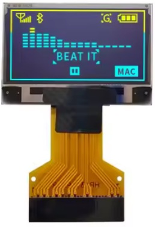

Un panneau nu sans carte de report séparée — juste la vitre et son ruban FPC 30 broches, soudé directement dans l'empreinte `CONN_OLED2` (`FPC30`, WiseChip UG-2864, le nom que ce document donne à ce que le schéma appelle `LCD1` — voir `BOM/BOM.TXT` et `URTC_NETLIST.TXT`). Sur les 30 broches, seul un sous-ensemble est réellement câblé — le reste est le bus d'interface parallèle du panneau (`D2`–`D7`, `RW`, `E/!RD`), laissé non connecté puisque la carte ne lui parle jamais qu'en I2C :

| Broche(s) CONN_OLED2 | Réseau | Fonction |
|---|---|---|
| 1, 8, 29, 30 | GND / AGND | Masse |
| 9 | VDD | Alimentation logique (depuis `+3V3B`, le rail dédié à l'OLED — voir BOM §1) |
| 28 | VCC | Alimentation du panneau |
| 2–5 | C2P/C2N/C1P/C1N | Condensateurs de pompe de charge — `C26`/`C27` dans la BOM |
| 26 | IREF | Résistance de réglage du courant de référence |
| 27 | VCOMH | Découplage de tension commune interne |
| 10, 12 | BS0, BS2 | Reliés à GND |
| 11 | BS1 | Relié à `+3V3B` |
| 18 | D0/SCK | I2C2 SCL — PA9 |
| 19 | D1/DIN/SDA | I2C2 SDA — PA10 |

`BS0`/`BS1`/`BS2` sont le strap de sélection d'interface propre au panneau (GND/VCC/GND ici), fixé matériellement plutôt qu'exposé au MCU — c'est ce qui place le contrôleur en mode I2C dès le départ, plutôt que dans le mode parallèle 8080/6800 auquel appartiennent les 22 autres broches du FPC.

#### Option B — module de report (`CONN_OLED`, alternative externe)


Le même panneau pré-monté sur une petite carte porteuse avec un connecteur 4 broches — utile si vous préférez câbler un module du commerce plutôt que de vous procurer le panneau FPC nu. Câblé directement sur `CONN_OLED` sans croisement nécessaire — l'ordre des broches propre au module (`GND · VDD · SCK · SDA`) correspond exactement au brochage de `CONN_OLED`, broche par broche :

| Broche module OLED | Broche CONN_OLED | Signal |
|---|---|---|
| GND | 1 | Masse |
| VDD | 2 | +3.3V (alimentation logique de l'écran) |
| SCK | 3 | SCL — PA9, I2C2 matériel |
| SDA | 4 | SDA — PA10, I2C2 matériel |

### Écran d'accueil

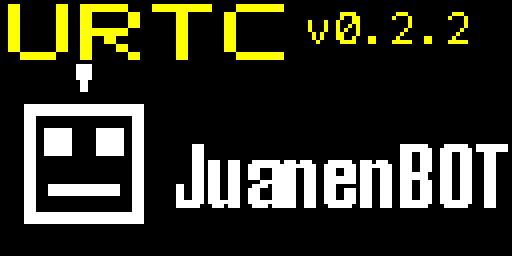


### Icônes d'outils (une par profil, animation 4 images)

<table>
<tr>
<td align="center"><br>Fer à souder T12</td>
<td align="center"><br>Distributeur de pâte</td>
<td align="center">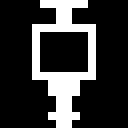<br>Distributeur de liquide</td>
<td align="center"><br>Tournevis</td>
</tr>
<tr>
<td align="center">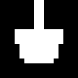<br>Pince à vide</td>
<td align="center"><br>Perceuse (BL4260)</td>
<td align="center"><br>Pince gimbal</td>
<td align="center"><br>Pince NEMA</td>
</tr>
<tr>
<td align="center">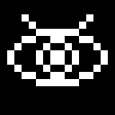<br>Inspection AOI</td>
<td align="center">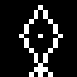<br>Graveur laser</td>
<td align="center">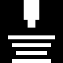<br>Hotend imprimante 3D</td>
<td align="center"><br>Sonde scanner 3D</td>
</tr>
<tr>
<td align="center"><br>Pick & Place SMT</td>
<td align="center"><br>Électroaimant</td>
<td align="center">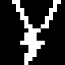<br>Soudeuse par points</td>
<td align="center">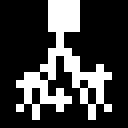<br>Revêtement conforme</td>
</tr>
<tr>
<td align="center">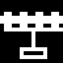<br>Pince à vide (grand format)</td>
<td align="center">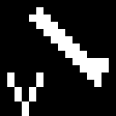<br>Sonde volante</td>
<td align="center"><br>Polymérisation UV</td>
<td align="center"><br>Retouche à air chaud</td>
</tr>
<tr>
<td align="center">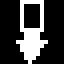<br>Insertion par pression</td>
<td align="center"><br>Actionneur de sertissage</td>
<td align="center"><br>Inspection thermique</td>
<td align="center">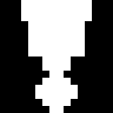<br>Jetting de pâte</td>
</tr>
<tr>
<td align="center"><br>Soudeuse par ultrasons</td>
</tr>
</table>


### Avertissement d'ID d'outil invalide

Si les cavaliers d'ID ne correspondent à aucun des 25 profils assignés, la carte bloque tous les actionneurs et affiche ceci à la place :


Tous les GIFs source d'animation se trouvent dans [`/ani`](ani/).

## 🔴🟢🔵 LED de statut numérique

Séparée de l'OLED et de l'anneau d'éclairage 8 pixels, `CONN_LED1` porte une unique LED RVB adressable (famille WS2812B, pilotée par SPI/DMA) dédiée au statut visible en un coup d'œil.

**Automatique par défaut, contournable par l'hôte à la demande.** Le firmware colore cette LED de lui-même, selon une priorité à trois niveaux :

* 🔴 **Rouge** — un défaut matériel est actif (`system_error_flag`). L'emporte toujours, quoi qu'il se passe par ailleurs.
* 🔵 **Bleu** — la carte fonctionne activement : une trame CAN (n'importe quel ID) est arrivée dans les 1.5 dernières secondes.
* 🟢 **Vert** — inactive, en attente de commandes : aucun trafic CAN depuis plus de 1.5 secondes.

Le maître peut toujours contourner cela à tout moment en envoyant l'ID CAN `0x100` (DLC 8) avec l'intensité rouge, verte et bleue comme les trois premiers octets (0-255 chacune — couleur 24 bits complète, pas seulement les trois automatiques). Une couleur envoyée par l'hôte tient pendant 10 secondes avant de revenir au schéma automatique — assez longtemps pour être réellement vue, assez court pour que la carte ne reste pas bloquée à afficher une couleur personnalisée périmée si l'hôte arrête de la mettre à jour. Renvoyer `0x100` (que ce soit la même couleur ou une nouvelle) rafraîchit cette fenêtre de 10 secondes, donc un hôte voulant garder le contrôle personnalisé n'a qu'à continuer à l'envoyer périodiquement. Un défaut matériel interrompt toujours un contournement actif — le rouge est toujours prioritaire sur toute couleur que l'hôte avait réglée.

Voir `docs/CANBUS.TXT` (ID `0x100`) pour la disposition exacte des octets, qui partage aussi ce même message avec l'anneau LED et le contrôle du mode nuit de l'OLED.

## 📸 Photos

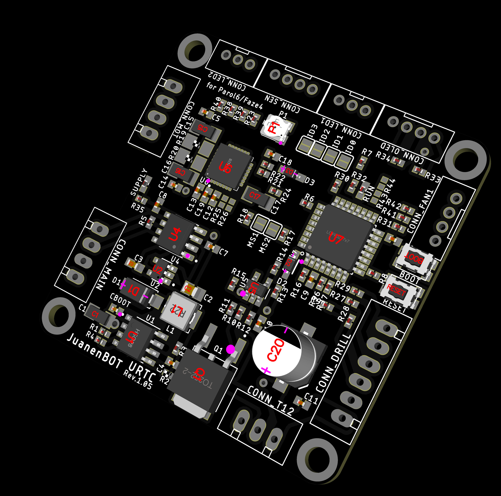

*(Travail en cours — d'autres angles et une carte peuplée arrivent bientôt.)*

## 🔧 Construction et flashage

Le flash d'URTC est divisé en deux parties indépendantes, de sorte que la carte puisse être reflashée via le même cordon ombilical CAN qu'elle utilise déjà pour tout le reste — sans jamais avoir besoin d'un accès physique au connecteur JTAG/SWD après la configuration initiale.

### Disposition de la mémoire flash (256K au total, modèle de mise à jour image dorée / A-B)

```
0x08000000 ┌─────────────────────────────────┐
           │  Bootloader (30K)                 │  S'exécute toujours en premier à
           │                                   │  chaque démarrage. Écoute
           │                                   │  brièvement sur CAN, puis soit
           │                                   │  saute vers l'application, soit
           │                                   │  attend une mise à jour. Pilote
           │                                   │  directement l'OLED pendant une
           │                                   │  mise à jour (voir ci-dessous).
0x08007800 ├─────────────────────────────────┤
           │  Page de métadonnées (2K)         │  Décrit ce qui se trouve
           │                                   │  actuellement dans le slot
           │                                   │  principal : HardwareID,
           │                                   │  version, taille, CRC32, et une
           │                                   │  signature HMAC-SHA256. Le
           │                                   │  bootloader vérifie le tout
           │                                   │  avant de jamais sauter vers
           │                                   │  l'application.
0x08008000 ├─────────────────────────────────┤
           │  Slot principal (112K)            │  C'est le firmware applicatif /
           │                                   │  URTC_MAIN_FIRMWARE_v0.2.3.* — le
           │                                   │  firmware réel qui tourne au
           │                                   │  quotidien, décrit partout
           │                                   │  ailleurs dans ce README. Jamais
           │                                   │  touché par une mise à jour tant
           │                                   │  qu'une image vérifiée et connue
           │                                   │  comme bonne n'est pas prête à
           │                                   │  le remplacer.
0x08024000 ├─────────────────────────────────┤
           │  Slot de secours / staging (112K) │  Stockage brut uniquement, jamais
           │                                   │  exécuté directement. Chaque mise
           │                                   │  à jour CAN y écrit d'abord.
0x08040000 └─────────────────────────────────┘
```

**Pourquoi un slot de secours.** Une mise à jour CAN n'est jamais écrite dans le slot actuellement en cours d'exécution. Elle va d'abord dans le secours, y est entièrement vérifiée — taille, CRC32, et une signature HMAC-SHA256 prouvant qu'elle provient réellement du propre processus de build de ce projet, et pas seulement qu'elle est arrivée intacte — et seulement ensuite copiée dans le slot principal. Une coupure de courant à tout moment avant que cette copie ne commence laisse le firmware actuellement en cours d'exécution totalement intact, donc il n'y a aucune fenêtre où un téléchargement interrompu peut rendre la carte inutilisable. Si la coupure de courant se produit *pendant* la copie elle-même, le bootloader s'en aperçoit au démarrage suivant (le secours, jamais touché pendant la copie, est toujours entièrement intact) et reprend simplement la copie à partir de là jusqu'à ce qu'elle réussisse.

### 0. Compilation depuis les sources (optionnel — `firmware/` fournit déjà des binaires précompilés)

Deux façons de passer des sources de ce dépôt aux 4 binaires ci-dessus :

- **Automatisée :** `build_firmware.sh` (Linux) ou `build_firmware.bat` (Windows), à la racine du dépôt. L'un ou l'autre installe la chaîne d'outils ARM GNU si elle est absente, récupère le commit ST HAL/CMSIS épinglé, et compile, lie, et passe en `objcopy` les 4 binaires (application + bootloader de la carte principale, application + bootloader de l'esclave d'extension) directement dans `firmware/`, puis régénère `firmware/firmware_manifest.json`. Exécutez sans argument pour une compilation complète, `--clean` pour vider d'abord le cache local `build/`, ou `master`/`slave` pour ne compiler que la paire propre à une seule puce. `build_firmware.sh` s'exécute de bout en bout contre l'arbre de sources réel de ce projet ; `build_firmware.bat` reproduit la même logique pour Windows — si les deux venaient à diverger, faites confiance à la logique du script `.sh` comme référence.
- **Manuelle :** chaque commande exécutée par l'un ou l'autre script, ainsi que le raisonnement derrière chaque choix de chaîne d'outils/HAL, est détaillée étape par étape dans `docs/COMPILE_STM32F303.TXT` — utile sur un autre OS, avec une autre source HAL/CMSIS, ou simplement pour voir exactement ce que les scripts automatisent.

Après tout changement de source du firmware (ou avant de faire confiance à une montée de version), exécutez **`check_version_consistency.sh`** depuis la racine du dépôt : il lit les constantes de version des pistes A/E (firmware de la carte principale, application de l'esclave d'extension) comme source de vérité et vérifie chaque emplacement documenté par `VERSION_CHECKLIST.txt` pour ce tag de version, en signalant toute incohérence — il ne fait que rapporter, il ne corrige rien lui-même. `VERSION_CHECKLIST.txt` est la référence complète pour les 5 pistes de version indépendantes que porte ce projet (firmware principal, matériel/PCB, bootloader principal, application de l'esclave d'extension, bootloader de l'esclave d'extension) et exactement ce qu'il faut modifier lors de la montée de l'une d'entre elles.

### 1. Configuration initiale — nécessite JTAG/SWD (une seule fois)

Le bootloader ne peut arriver sur la puce que via une programmation physique — il n'existe aucun moyen de flasher par CAN une carte qui n'a pas encore de bootloader dessus. C'est une étape unique :

1. Ouvrez le projet dans **STM32CubeIDE** (construit et testé contre la cible STM32F303CC), ou utilisez **STM32CubeProgrammer** directement avec les sorties compilées ci-dessous.
2. Flashez **les deux** images via SWD (ST-Link) via le connecteur `STM_JTAG` embarqué — chaque fichier `.hex` contient son adresse cible intégrée, donc la plupart des outils (y compris STM32CubeProgrammer) peuvent charger les deux dans la même session :
   * `URTC_MAIN_BOOTLOADER_v0.3.2.hex` → `0x08000000`
   * `URTC_MAIN_FIRMWARE_v0.2.3.hex` → `0x08008000`
3. Réglez l'identité de l'outil via les cavaliers à souder d'ID avant la mise sous tension — la carte les lit une fois au démarrage, comme toujours. Cinq cavaliers (ID0-ID4), couvrant l'espace complet de 32 adresses (31 adresses d'outils directes, plus l'adresse de configuration libre réservée `11111` - voir la section Matrice d'outils ci-dessus).
4. Mise sous tension. Le bootloader écoute pendant ~600ms, ne voit rien, et saute directement dans l'application — à partir de là, tout se comporte exactement comme décrit dans le reste de ce README.

**Le connecteur JTAG n'est jamais retiré ni désactivé.** Il est toujours là comme solution de secours — si une mise à jour CAN tourne mal un jour, ou si vous préférez simplement cette méthode, vous pouvez reflasher l'une ou l'autre image via SWD à tout moment.

**Deux boutons-poussoirs embarqués, BOOT et RESET**, sont également présents pour la récupération — RESET est une réinitialisation matérielle ordinaire (`NRST`), et BOOT met `BOOT0` à l'état haut, ce qui est une décision au niveau de la puce prise *avant* que quoi que ce soit dans ce dépôt ne s'exécute : normalement (non maintenu), la puce démarre depuis la flash vers le propre bootloader de ce projet comme décrit ci-dessus ; maintenu au reset, elle démarre plutôt dans le bootloader de mémoire système d'usine propre à ST (récupération USB DFU/UART, entièrement séparée de tout ce qui se trouve ici). Voir `src/F303-master/README.md` section 4a pour le détail technique complet.

### 2. Mises à jour ultérieures — via le bus CAN

Une fois le bootloader en place, la mise à jour de l'application ne nécessite plus du tout d'accès physique à la carte — il suffit d'envoyer le nouveau build de firmware sur la même ligne CAN ombilicale qui porte déjà les commandes vers la tête d'outil.

**La séquence de mise à jour :**

1. **Déclenchement.** Le maître envoie `0x7F0` (DLC 4, charge utile `B0 07 1D 5A`) à l'*application en cours d'exécution*. Elle coupe en toute sécurité l'alimentation de chaque actionneur en ligne — moteurs, éléments chauffants, laser — et réinitialise la puce. Cette exigence de charge utile magique signifie qu'une trame corrompue ou malformée ne peut pas déclencher accidentellement une réinitialisation vers le mode mise à jour.
2. **Démarrage.** Après la réinitialisation, le bootloader écoute. Le maître envoie `0x7F1` (DLC 8, taille totale du firmware en big-endian + HardwareID en big-endian). Une image construite pour un matériel différent est rejetée ici même, avant qu'un seul octet de flash ne soit touché. Le bootloader efface exactement autant de pages du slot de secours que la nouvelle image en nécessite et répond par une trame de statut (`0x7F5`).
3. **Signature.** Le maître envoie la signature HMAC-SHA256 attendue sous forme de quatre trames `0x7F7` (8 octets chacune, dans l'ordre) — calculée sur l'image du firmware avec une clé partagée entre le bootloader et l'outil qui signe le build.
4. **Données.** Le maître diffuse le fichier `.bin` sous forme d'une séquence de trames `0x7F2` (jusqu'à 8 octets de données brutes de firmware chacune), envoyées consécutivement — CAN garantit que les trames arrivent dans l'ordre où elles ont été envoyées sur un bus unique, donc aucun numéro de séquence par trame n'est nécessaire. Le bootloader met en tampon les octets entrants dans une page de 2Ko en RAM et l'écrit dans le slot *de secours* une fois pleine, relisant chaque demi-mot et le comparant à ce qui devait être écrit avant de considérer la page terminée, et envoyant un accusé de réception `0x7F3` (avec l'index de page) après chaque écriture vérifiée. Une implémentation maître raisonnable attend l'ACK de chaque page avant d'envoyer les données de la page suivante, pour éviter de dépasser le tampon de réception du bootloader.
5. **Fin et vérification.** Une fois tous les octets envoyés, le maître envoie `0x7F4` (DLC 8, CRC32 big-endian + version majeure/mineure). Le bootloader vérifie la taille du slot de secours, calcule son CRC32 et son HMAC-SHA256 et compare les deux à ce que le maître a déclaré. Seulement si tout correspond, il procède à la copie du secours vers le slot principal, page par page, avec la même vérification de relecture que ci-dessus. Une fois cette copie terminée et confirmée, il sauvegarde les nouvelles métadonnées et redémarre vers l'application mise à jour. En cas de non-correspondance quelconque — taille, CRC32, HMAC, ou HardwareID — le slot principal n'est jamais touché du tout, et le bootloader retourne simplement à l'écoute pour une nouvelle tentative.

**Trames de statut (`0x7F5`, DLC 1) :** `0x01` en écoute, `0x02` effacement, `0x03` réception, `0x06` vérification, `0x07` copie du secours vers le principal, `0x04` vérifié OK (sur le point de sauter), `0x05` échec de vérification, `0xFF` erreur.

**Battement de cœur (`0x7F6`, DLC 2, toutes les ~1s pendant l'écoute ou la mise à jour) :** octet de statut + pourcentage de progression (0-100, ou `0xFF` là où un pourcentage ne s'applique pas). Permet au maître de distinguer « le nœud est vivant mais n'a pas encore commencé à écouter » de « le nœud ne répond pas du tout » - utile pour la mise en service automatisée et pour repérer un bootloader bloqué sans attendre un timeout.

**Progression à l'écran.** Le bootloader pilote directement l'OLED pendant une mise à jour — personne n'a besoin de deviner si quelque chose se passe. Il affiche « UPDATING » avec une barre de progression et un pourcentage en direct pendant que les pages sont écrites ou copiées, « FLASH OK » un court instant avant de redémarrer vers le nouveau firmware, et « ERROR » si l'écriture d'une page échoue, si le transfert stagne pendant plus de 10 secondes, ou si la vérification révèle une non-correspondance.

**⚠️ Testez ceci sur banc avant de lui faire confiance sur le terrain.** Le protocole ci-dessus compile et lie proprement et la logique a été soigneusement raisonnée, mais un bootloader est exactement le genre de firmware où « compile correctement » est très loin de « digne de confiance sur du matériel » — le timing réel de programmation flash, le comportement CAN sur un transfert de plusieurs milliers de trames, et la remise bootloader-vers-application doivent tous être vérifiés sur une carte réelle (idéalement avec un JTAG à portée de main comme filet de sécurité) avant de s'appuyer là-dessus pour une mise à jour non surveillée avec de vrais actionneurs connectés.

### Outils PC

Deux outils GUI autonomes, multiplateformes (Windows/Linux) accompagnent
cette carte - **URTC Flasher** (mises à jour CAN-OTA et SWD/JTAG puce
complète, à la fois pour cette carte et, sur une variante d'extension
Avancée, sa propre puce esclave d'extension) et **URTC Tester** (un
exerciseur de bus CAN en direct montrant quel profil d'outil est
actuellement câblé). Les deux vivaient auparavant dans ce dépôt sous
`tools/` ; chacun est désormais son propre projet indépendant, avec
son propre README, sa propre licence, et ses propres traductions :

- [URTC Flasher](https://github.com/JuanenRac/URTC-FLASHER)
- [URTC Tester](https://github.com/JuanenRac/URTC-TESTER)

Une alternative basée sur le web couvrant un terrain similaire
(surveillance en direct, analyse CAN, flashage OTA, inspection
thermique) sans rien installer localement existe également :
[URTC Web Studio](https://github.com/JuanenRac/URTC-WEB-STUDIO).

## 📋 Journal des modifications

Le firmware et le bootloader sont versionnés et publiés
indépendamment - flasher un nouveau bootloader n'implique pas une
nouvelle version d'application et vice versa, donc chacun a son propre
historique dans son propre fichier plutôt qu'un numéro de version
combiné qui laisserait croire qu'ils avancent toujours ensemble :

- Firmware (`src/F303-master/`) : [`src/F303-master/CHANGELOG.md`](src/F303-master/CHANGELOG.md)
- Bootloader (`src/F303-master/boot/`) : [`src/F303-master/boot/CHANGELOG.md`](src/F303-master/boot/CHANGELOG.md)
- Application de l'esclave d'extension (`src/F303-slave/`, STM32F303CBT6) : [`src/F303-slave/CHANGELOG.md`](src/F303-slave/CHANGELOG.md)
- Bootloader de l'esclave d'extension (`src/F303-slave/boot/`) : [`src/F303-slave/boot/CHANGELOG.md`](src/F303-slave/boot/CHANGELOG.md)

**Politique de versionnage :** les 4 composants (2 firmwares applicatifs, 2 bootloaders - `FIRMWARE_VERSION_MAJOR`/`MINOR`/`PATCH` et `BOOTLOADER_VERSION_MAJOR`/`MINOR`/`PATCH`) sont **incrémentaux** - chaque build réel incrémente automatiquement le `PATCH` propre à ce composant de 1 (`bump_version.py` à la racine du dépôt, appelé par `build_firmware.sh`/`.bat` juste avant de compiler chaque composant), avec report vers `MINOR` (puis `MAJOR`) dès que `PATCH` dépasserait 9, la même règle en base 10 qu'un compteur kilométrique - ex. `0.1.7` → `0.1.8` → `0.1.9` → `0.2.0`, jamais `0.1.10`. Chaque bootloader conserve aussi sa propre copie du `FIRMWARE_VERSION_*` de l'application correspondante, synchronisée automatiquement par le même bump. Voir [`CHANGELOG.md`](CHANGELOG.md) à la racine du dépôt pour l'état actuel des 4 composants en un coup d'œil, et [`VERSION_CHECKLIST.txt`](VERSION_CHECKLIST.txt) pour la mécanique complète par piste.

## 🔍 Statut actuel

**Firmware (`src/F303-master/`) :** fonctionnellement complet pour les 25 profils d'outils — contrôle PID thermique, télémétrie par outil, watchdogs de communication, détection de blocage/défaut, et diagnostics en direct propres à l'OLED, ainsi qu'une paire de requête d'outil actif (`0x110`/`0x111`), un passage SPI générique (`0x180`/`0x181`) pour le connecteur d'extension, une F-RAM embarquée qui conserve les consignes en cas de coupure de courant (`0x190`/`0x191`), le mécanisme de configuration d'outil libre par cavalier `11111` (`0x1A2`/`0x1A3`), la remontée du type de périphérique + numéro de série de l'appareil (`0x1A4`/`0x1A5`) pour distinguer plusieurs cartes autrement identiques sur un bus partagé, et un pont CAN-vers-I2C (`0x210`-`0x221`) atteignant la puce esclave d'extension sur les cartes d'extension avancées. Versionné indépendamment du bootloader (voir le Journal des modifications ci-dessous).

**Bootloader (`src/F303-master/boot/`) :** système de mise à jour A/B image dorée fonctionnellement complet — mises à jour OTA signées HMAC-SHA256 via CAN, un slot de secours qui garantit qu'une mise à jour échouée ne rend jamais la carte inutilisable, et sa propre remontée de version (`0x7FA`) indépendante de l'application. Compile et lie proprement ; voir la mise en garde de test sur banc ci-dessus avant de lui faire confiance sans surveillance avec de vrais actionneurs connectés.

**Outils PC :** à la fois [URTC Flasher](https://github.com/JuanenRac/URTC-FLASHER) (mises à jour CAN OTA + programmation SWD/JTAG puce complète) et [URTC Tester](https://github.com/JuanenRac/URTC-TESTER) (exerciseur de contrôle/télémétrie en direct par outil) sont fonctionnellement complets pour ce qu'ils sont censés faire, chacun étant désormais son propre projet indépendant avec son propre README couvrant la configuration et chaque contrôle en détail.

**Matériel :** le schéma et la nomenclature sont encore en cours de finalisation ; aucune carte peuplée n'existe encore pour valider quoi que ce soit de ce qui précède contre du silicium réel. Tout ce qui précède compile, lie, et a été soigneusement raisonné, mais « compile correctement » et « vérifié sur matériel » sont deux affirmations différentes — voir l'avis de sécurité en haut de ce README, et abordez une première mise en service avec la prudence que mérite toute nouvelle carte.

Si quelqu'un dans la communauté travaille sur des effecteurs terminaux personnalisés, des changeurs d'outils intelligents, ou une intégration d'outils avancée pour PAROL6, Faze4, ou toute autre plateforme de bras robotique, j'adorerais discuter, échanger des idées, ou approfondir les commandes CAN !

## 📂 Structure du dépôt

```
/
├── 3D/
│   ├── RACK/                    Support de montage de la carte, 2 variantes (x1, x3) -
│   │                            chacune en .stl/.3mf/.amf/.scad
│   ├── REVOLVER/                Placeholder - vide, contenu pas encore commencé
│   └── TOOLS/
│       └── PAROL6/              Pièces imprimables en 3D par outil pour le bras robotique
│                                PAROL6 - un sous-dossier par outil (0.Universal parts, puis
│                                1-12 correspondant à la numérotation du Catalogue d'outils
│                                ci-dessus), chacun en .stl/.3mf/.amf/.scad quand peuplé ;
│                                plusieurs (4, 6-12) sont encore des placeholders vides
├── ani/                          27 GIFs : une animation 4 images par profil d'outil (00-24,
│                                 correspondant à l'ID numérique propre à chaque outil),
│                                 l'écran d'accueil (splash_boot.gif), et l'avertissement
│                                 d'ID invalide (error_warning.gif) - tous décodés directement
│                                 depuis les propres sources firmware de ce projet (les
│                                 tables ToolIcons[]/SplashFace[]/ErrorText[] propres à
│                                 firmware_render.c), pas dessinés à la main séparément, donc
│                                 ils correspondent toujours à ce que l'OLED réel affiche
│                                 vraiment
├── BOM/
│   ├── BOM.TXT                  Nomenclature complète de la carte PCB
│   ├── BOM_EXPANSION_BASIC_TMC2209.TXT     Carte d'extension, basique + TMC2209
│   ├── BOM_EXPANSION_BASIC_TMC5160A.TXT    Carte d'extension, basique + TMC5160A
│   ├── BOM_EXPANSION_ADVANCED_TMC2209.TXT  Carte d'extension, avancée + TMC2209
│   ├── BOM_EXPANSION_ADVANCED_TMC5160A.TXT Carte d'extension, avancée + TMC5160A
│   ├── BOM_EXPANSION_BASIC_ADS1115.TXT     Carte d'extension, basique + ADS1115 (capteur seul, pas de pilote/MCU)
│   └── BOM_EXPANSION_BASIC_MLX9064X.TXT    Carte d'extension, basique + MLX9064x (capteur seul, pas de pilote/MCU)
├── docs/
│   ├── CANBUS.TXT               Référence du protocole bus CAN (tous les ID commande/télémétrie)
│   ├── ECOVIA.TXT               Matrice d'identification d'outils et logique de mutation de broches
│   ├── TOOLS.TXT                Catalogue haut niveau des 25 outils - ce que fait chacun et
│   │                            quels périphériques il utilise, sans détail au niveau broche
│   ├── PINOUT.TXT               Brochage complet du MCU, bloc par bloc
│   ├── PINOUT_CONNECTORS.TXT    Brochages physiques des connecteurs (CONN_DRILL, CONN_SEN, etc.)
│   ├── EXPANSION.TXT            Connecteur CONN_EXPANSION et les variantes de carte d'extension
│   ├── PINOUT_SLAVE.txt         Brochage complet pour la puce esclave d'extension (variantes avancées uniquement)
│   ├── EEPROM.TXT               Carte complète des registres F-RAM (chaque réglage persisté, décalages d'octets)
│   ├── COMPILE_STM32F303.TXT    Guide de compilation complet pour les 4 binaires firmware -
│   │                            chaîne d'outils, configuration ST HAL/CMSIS, commandes exactes
│   │                            de compilation/liaison ; build_firmware.sh/.bat à la racine du
│   │                            dépôt automatisent ce même processus de bout en bout
│   ├── datasheet/               2 fiches techniques de composants non déjà couvertes sous
│   │                            PCB/datasheet/ (CFM_40.pdf, EFB0424VHD-CP0.pdf)
│   └── tool_image_generator/    Boîte à outils qui génère images/TOOL_*.png (voir ci-dessous) -
│                                render_engine.py + tool_data.py + generate_all.py, et
│                                PROCEDURE.TXT expliquant comment ajouter l'image propre d'un
│                                nouvel outil ou régénérer une image existante
├── src/
│   ├── F303-master/
│   │   ├── STM32F303CC_main.c    Point d'entrée - définitions globales et main()
│   │   ├── firmware_*.c/.h       ~85 fichiers supplémentaires, un par sous-système (OLED, LEDs,
│   │   │                         gestionnaires CAN par outil, initialisation, persistance,
│   │   │                         etc.), y compris firmware_ads1115.c (pilote ADS1115 direct,
│   │   │                         carte Basic+ADS1115) - voir le README.md propre à ce dossier
│   │   │                         pour le tableau complet fichier par fichier
│   │   ├── melexis_mlx90640/     Bibliothèque MLX90640 officielle propre à Melexis (Apache-2.0,
│   │   │                         C pur) plus le pilote de connexion directe propre à cette
│   │   │                         carte au-dessus, pour la carte d'extension Basic+MLX9064x
│   │   ├── melexis_mlx90641/     Même idée, bibliothèque MLX90641 (Apache-2.0, C++ - voir la
│   │   │                         section 8a du README.md propre à ce dossier pour pourquoi
│   │   │                         cette bibliothèque est en C++ dans un projet par ailleurs
│   │   │                         tout en C)
│   │   ├── melexis_mlx90642/     Même idée, bibliothèque MLX90642 (Apache-2.0, C pur) - voir
│   │   │                         la section 8a pour pourquoi le pilote propre à ce capteur est
│   │   │                         véritablement plus simple que les 2 autres
│   │   ├── STM32F303CCTx_APP.ld  Script de liaison pour l'application (slot principal 112K à 0x08008000)
│   │   ├── README.md             Référence technique : plateforme matérielle, le système de
│   │   │                         sélection d'outil par cavalier ID, câblage des périphériques
│   │   │                         par outil - voir CANBUS.TXT pour le protocole au niveau fil
│   │   │                         que ceci explique le pourquoi
│   │   └── boot/
│   │       ├── bootloader_main.c  Point d'entrée pour le bootloader
│   │       ├── bootloader_*.c/.h  9 fichiers supplémentaires (types/constantes partagés, crypto,
│   │       │                      flash/métadonnées, OLED, protocole CAN)
│   │       ├── STM32F303CCTx_BOOTLOADER.ld  Script de liaison pour le bootloader (région 30K à 0x08000000)
│   │       └── README.md          Même rôle de référence technique que celui de l'application, pour le bootloader
│   └── F303-slave/               Puce compagnon (STM32F303CBT6) sur les 2 variantes de carte
│       │                         d'extension AVANCÉES uniquement - voir la section Connecteur
│       │                         d'extension ci-dessus. Sa propre paire bootloader/application,
│       │                         son propre protocole de mise à jour basé I2C (pas CAN), son
│       │                         propre versionnage indépendant.
│       ├── slave_main.c          Point d'entrée
│       ├── slave_*.c/.h          7 fichiers supplémentaires (types/constantes partagés,
│       │                         protocole de liaison I2C, bus de capteurs local, PWM local)
│       ├── STM32F303CBTx_SLAVEAPP.ld  Script de liaison (slot principal 54K à 0x08005000)
│       ├── README.md             Référence technique : pourquoi cette puce existe, le bus de
│       │                         capteurs local ADS1115/MLX9064x, le PWM local, le protocole
│       │                         de liaison I2C vers la carte principale
│       ├── melexis_mlx90640/     Bibliothèque MLX90640 officielle propre à Melexis (Apache-2.0,
│       │                         C pur, non modifiée, fichier de licence propre) - conservée
│       │                         comme sa propre unité de compilation séparée, délibérément
│       │                         jamais fusionnée dans les propres sources de ce projet,
│       │                         puisque Apache-2.0 exige que la mention de copyright propre
│       │                         à ce code reste intacte
│       ├── melexis_mlx90641/     Bibliothèque MLX90641 officielle propre à Melexis (Apache-2.0,
│       │                         C++ - une bibliothèque véritablement séparée de celle de
│       │                         MLX90640, pas une variante de celle-ci - voir la section 3 du
│       │                         README.md propre à ce dossier pour pourquoi c'est du C++ et
│       │                         comment la compilation gère cela)
│       ├── melexis_mlx90642/     Bibliothèque MLX90642 officielle propre à Melexis (Apache-2.0,
│       │                         C pur) - interface de transport véritablement plus simple que
│       │                         celle des 2 autres capteurs, voir la section 3 du README.md
│       │                         pour pourquoi
│       └── boot/
│           ├── slaveboot_main.c   Point d'entrée pour le bootloader
│           ├── slaveboot_*.c/.h   7 fichiers supplémentaires (crypto, flash/métadonnées, protocole)
│           ├── STM32F303CBTx_SLAVEBOOT.ld  Script de liaison (région 18K à 0x08000000)
│           └── README.md          Même rôle de référence technique que celui de l'application
├── firmware/
│   ├── URTC_MAIN_BOOTLOADER_v0.3.2.bin  Bootloader compilé, à flasher à 0x08000000
│   ├── URTC_MAIN_BOOTLOADER_v0.3.2.elf  Bootloader compilé, à flasher à 0x08000000
│   ├── URTC_MAIN_BOOTLOADER_v0.3.2.hex  Bootloader compilé, à flasher à 0x08000000 (adresse intégrée)
│   ├── URTC_MAIN_FIRMWARE_v0.2.3.bin    Bin d'application compilé, à flasher à 0x08008000
│   ├── URTC_MAIN_FIRMWARE_v0.2.3.elf    Elf d'application compilé, à flasher à 0x08008000
│   ├── URTC_MAIN_FIRMWARE_v0.2.3.hex    HEX d'application compilé, à flasher à 0x08008000 (adresse intégrée)
│   ├── URTC_SLAVE_BOOTLOADER_v0.1.5.{bin,elf,hex}  Bootloader propre à l'esclave d'extension, à flasher à 0x08000000
│   │                             sur le STM32F303CBT6 (cartes d'extension avancées uniquement)
│   ├── URTC_SLAVE_FIRMWARE_v0.1.2.{bin,elf,hex}  Application propre à l'esclave d'extension, à flasher à 0x08005000
│   └── firmware_manifest.json    Index lisible par machine des 4 composants ci-dessus - version,
│                                 adresse flash, et la taille/CRC32 propre à chaque fichier, pour
│                                 qu'un outil externe puisse vérifier ce qui est présent et ce qui
│                                 est plus récent que ce qu'il possède actuellement. Régénéré
│                                 automatiquement par generate_manifest.py (appelé par la
│                                 dernière étape propre à build_firmware.sh/.bat) - jamais
│                                 modifié à la main.
├── images/
│   ├── OLED_DIRECT_MOUNT.jpg     LCD1/CONN_OLED2 - panneau FPC 30 broches nu, option montage direct
│   ├── OLED_BREAKOUT_MODULE.jpg  CONN_OLED - module de report I2C externe, option alternative
│   ├── URTC_LOGO.svg             Logo général du projet, intégré en haut de ce README
│   ├── URTC_BOARD.png           Photo de la carte
│   ├── URTC_SCHEMATIC.png       Schéma de la carte
│   ├── URTC_PCB_TOP.png         Couche DESSUS de la carte (une fois ajoutée)
│   ├── URTC_PCB_BOTTOM.png      Couche DESSOUS de la carte (une fois ajoutée)
│   └── TOOL_*.png               Schéma de référence cavaliers/câblage par outil, un par profil
│                                (les 25 présents - voir le lien propre à chaque outil dans le Catalogue d'outils ci-dessus)
├── PCB/
│   ├── URTC_V1.0.sch            Schéma Eagle (une fois ajouté)
│   ├── URTC_V1.0.brd            Disposition de carte Eagle (une fois ajoutée)
│   ├── URTC_V1.0_JLCPCB.ZIP     Fichiers gerbers, bom et cpl (une fois ajoutés)
│   ├── URTC_BOM.TXT             BOM brute exportée d'Eagle (export de référence - voir
│   │                            BOM/BOM.TXT pour la propre version organisée et curée de ce projet)
│   ├── datasheet/               Fiches techniques de tous les composants utilisés sur la carte
│   └── *_PARLIST/PINLIST/NETLIST.TXT   Netlists exportées d'Eagle (référence pour le mappage des broches)
├── VERSION_CHECKLIST.txt        Liste de contrôle mécanique pour monter correctement l'un
│                                quelconque des 4 numéros de version indépendants propres à ce projet
├── check_version_consistency.sh  Vérifications automatisées de cohérence version/fichier - à
│                                exécuter avant de faire confiance aux affirmations propres de VERSION_CHECKLIST.txt
├── build_firmware.sh            Installe la chaîne d'outils, récupère le propre HAL/CMSIS de ST, et
│                                compile les 4 binaires firmware de bout en bout (Linux)
├── build_firmware.bat           Idem, pour Windows - voir docs/COMPILE_STM32F303.TXT pour
│                                le processus manuel complet que chaque script automatise
├── generate_manifest.py         Régénère firmware/firmware_manifest.json - appelé
│                                automatiquement comme dernière étape d'une exécution complète
│                                de build_firmware.sh/.bat, ou de façon autonome à tout moment
│                                où le manifeste doit rattraper son retard sans recompilation complète
├── LICENSE
├── README.md                    Ce fichier
└── README_spa.md / README_ita.md / README_fra.md / README_deu.md / README_zho.md / README_jpn.md  <- traductions
```

Les fichiers de conception matérielle (schéma/carte/netlists Eagle) seront ajoutés à mesure que la disposition se stabilise.

## 🔗 Projets liés

Ce projet fait partie d'un écosystème robotique plus large du même auteur (JuanenRac / Electro Hobby 3D), couvrant de nombreux projets entre firmware, matériel et logiciel. Bon à savoir, car une demande pourrait en réalité concerner l'un de ces projets plutôt que ce dépôt.

**Directement liés à ce projet**
- **[URTC-SMART-RACK](https://github.com/JuanenRac/URTC-SMART-RACK)** — partage le même écosystème d'outils et le même bus CAN que ce firmware.
- **[URTC-VISION-TOOL](https://github.com/JuanenRac/URTC-VISION-TOOL)** — partage le même écosystème d'outils et le même bus CAN que ce firmware.
- **[HYDRA-UMC-DETECTION-HEF](https://github.com/JuanenRac/HYDRA-UMC-DETECTION-HEF)** — apporte la reconnaissance visuelle propre aux outils de ce firmware.

**Reste de l'écosystème**

💠 Écosystème Central
- [HYDRA-UMC](https://github.com/JuanenRac/HYDRA-UMC)
- [HYDRA-UMC-SERVER](https://github.com/JuanenRac/HYDRA-UMC-SERVER)
- [HYDRA-UMC-STUDIO](https://github.com/JuanenRac/HYDRA-UMC-STUDIO)
- [HYDRA-UMC-SUITE](https://github.com/JuanenRac/HYDRA-UMC-SUITE)
- [HYDRA-UMC-DSI](https://github.com/JuanenRac/HYDRA-UMC-DSI)
- [HYDRA-UMC-ANDROID-CONTROL](https://github.com/JuanenRac/HYDRA-UMC-ANDROID-CONTROL)
- [HYDRA-UMC-IOS-CONTROL](https://github.com/JuanenRac/HYDRA-UMC-IOS-CONTROL)
- [HYDRA-UMC-EDITOR-URDF](https://github.com/JuanenRac/HYDRA-UMC-EDITOR-URDF)
- [URTC-FLASHER](https://github.com/JuanenRac/URTC-FLASHER)
- [URTC-TESTER](https://github.com/JuanenRac/URTC-TESTER)
- [URTC-WEB-STUDIO](https://github.com/JuanenRac/URTC-WEB-STUDIO)

👁️ Nœud d'IA de Vision (Hailo-8)
- [HYDRA-UMC-VISION-NODE](https://github.com/JuanenRac/HYDRA-UMC-VISION-NODE)
- [HYDRA-UMC-VISION-STREAMER](https://github.com/JuanenRac/HYDRA-UMC-VISION-STREAMER)
- [HYDRA-UMC-SAFETY-ZONES](https://github.com/JuanenRac/HYDRA-UMC-SAFETY-ZONES)
- [HYDRA-UMC-VISUAL-SERVOING-API](https://github.com/JuanenRac/HYDRA-UMC-VISUAL-SERVOING-API)

🧠 Nœud d'IA Cognitive (Hailo-10)
- [HYDRA-UMC-COGNITIVE-NODE](https://github.com/JuanenRac/HYDRA-UMC-COGNITIVE-NODE)
- [HYDRA-UMC-VLA-ENGINE](https://github.com/JuanenRac/HYDRA-UMC-VLA-ENGINE)
- [HYDRA-UMC-VOICE-UI](https://github.com/JuanenRac/HYDRA-UMC-VOICE-UI)
- [HYDRA-UMC-SEMANTIC-PLANNER](https://github.com/JuanenRac/HYDRA-UMC-SEMANTIC-PLANNER)
- [HYDRA-UMC-DOCS-QA](https://github.com/JuanenRac/HYDRA-UMC-DOCS-QA)

🐝 Orchestration et Essaim
- [HYDRA-UMC-ORCHESTRATOR](https://github.com/JuanenRac/HYDRA-UMC-ORCHESTRATOR)
- [HYDRA-UMC-SWARM-SYNC](https://github.com/JuanenRac/HYDRA-UMC-SWARM-SYNC)
- [HYDRA-UMC-PATH-PLANNER-3D](https://github.com/JuanenRac/HYDRA-UMC-PATH-PLANNER-3D)
- [HYDRA-UMC-JOB-DISPATCHER](https://github.com/JuanenRac/HYDRA-UMC-JOB-DISPATCHER)
- [HYDRA-UMC-NODE-HEALING](https://github.com/JuanenRac/HYDRA-UMC-NODE-HEALING)

🎮 Jumeau Numérique et Simulation
- [HYDRA-UMC-TWIN](https://github.com/JuanenRac/HYDRA-UMC-TWIN)
- [HYDRA-UMC-PHYSICS-REPLICA](https://github.com/JuanenRac/HYDRA-UMC-PHYSICS-REPLICA)
- [HYDRA-UMC-HIL-BRIDGE](https://github.com/JuanenRac/HYDRA-UMC-HIL-BRIDGE)
- [HYDRA-UMC-SYNTHETIC-DATA-GEN](https://github.com/JuanenRac/HYDRA-UMC-SYNTHETIC-DATA-GEN)

📊 Données et Analytique
- [HYDRA-UMC-DATALAKE](https://github.com/JuanenRac/HYDRA-UMC-DATALAKE)
- [HYDRA-UMC-TELEMETRY-COLLECTOR](https://github.com/JuanenRac/HYDRA-UMC-TELEMETRY-COLLECTOR)
- [HYDRA-UMC-ANOMALY-DETECTOR](https://github.com/JuanenRac/HYDRA-UMC-ANOMALY-DETECTOR)
- [HYDRA-UMC-PRODUCTION-REPORTS](https://github.com/JuanenRac/HYDRA-UMC-PRODUCTION-REPORTS)

🏭 Passerelle Industrielle
- [HYDRA-UMC-GATEWAY-INDUSTRIAL](https://github.com/JuanenRac/HYDRA-UMC-GATEWAY-INDUSTRIAL)
- [HYDRA-UMC-OPCUA-SERVER](https://github.com/JuanenRac/HYDRA-UMC-OPCUA-SERVER)
- [HYDRA-UMC-MQTT-BROKER](https://github.com/JuanenRac/HYDRA-UMC-MQTT-BROKER)
- [HYDRA-UMC-MTCONNECT-ADAPTER](https://github.com/JuanenRac/HYDRA-UMC-MTCONNECT-ADAPTER)

🛠️ Outils Complémentaires
- [HYDRA-UMC-WATCH](https://github.com/JuanenRac/HYDRA-UMC-WATCH)
- [HYDRA-UMC-TOOL-CLI](https://github.com/JuanenRac/HYDRA-UMC-TOOL-CLI)
- [HYDRA-UMC-DASHBOARD-AI](https://github.com/JuanenRac/HYDRA-UMC-DASHBOARD-AI)

## 👤 AUTEUR
**JuanenRac** (Electro Hobby 3D)
📧 electrohobby3d@gmail.com
📺 [youtube.com/@electrohobby3d](https://youtube.com/@electrohobby3d)

## 📜 LICENCE

URTC est (c) 2026 JuanenRac (Electro Hobby 3D). Cet avis doit être inclus dans toute distribution de ce projet ou de travaux dérivés.

Comme ce projet est constitué de plusieurs types de contenu différents, les différentes parties sont mises à disposition sous des licences différentes - chacune adaptée à ce qu'elle couvre réellement, plutôt que de forcer une seule licence à convenir à tout :

1. Le **firmware** situé dans `./firmware` (application et bootloader CAN inclus) est disponible sous la **GNU General Public License v3.0 (GPL-3.0)**. Texte complet sur https://www.gnu.org/licenses/gpl-3.0.html.

2. Les **conceptions matérielles** (fichiers schéma/carte Eagle, gerbers, et les pièces imprimables en 3D sous `./PCB` et `./3D`) sont disponibles sous la **CERN Open Hardware Licence v2 - Strongly Reciprocal (CERN-OHL-S v2)**. Texte complet sur https://cern-ohl.web.cern.ch/.

3. La **documentation** (ce README et ses propres traductions - `README_spa.md`, `README_ita.md`, `README_fra.md`, `README_deu.md`, `README_zho.md`, `README_jpn.md` - plus les fichiers de référence sous `./docs`) est disponible sous **Creative Commons Attribution-ShareAlike 4.0 International (CC BY-SA 4.0)**. Texte complet sur https://creativecommons.org/licenses/by-sa/4.0/.

Si vous construisez sur ce projet, gardez à l'esprit la séparation des licences : les modifications de code au firmware devraient rester GPL-3.0, les modifications matérielles devraient rester CERN-OHL-S, et les dérivés de documentation devraient rester CC BY-SA - chacun avec attribution à ce projet.

Ce dépôt couvre uniquement le propre firmware et matériel de la carte URTC - les outils PC (URTC Flasher, URTC Tester) qui vivaient auparavant ici sont désormais des projets indépendants avec leur propre licence, voir « Outils PC » ci-dessus.
